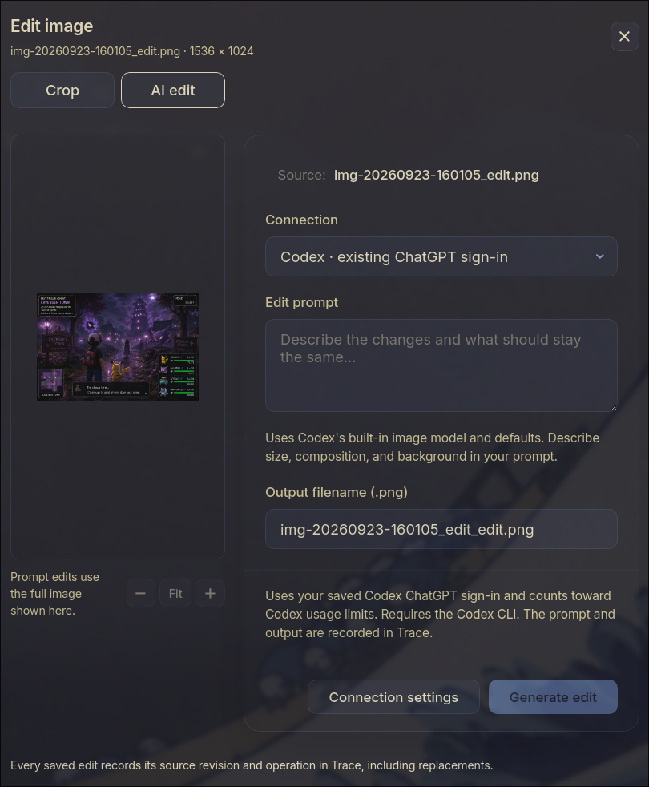

## Changes to Trace Explorer Plugin
- ctrl+e on image file should bring up the edit image modal (AI Edit)
- ctrl+enter should do the generation
- we need to overhaul the edit image UI. it needs options for resolution (2k by default), aspect ratio (default is "keep the same"), and seed. Remove all the bloat and reminder text. remove the output filenmame - it should just be, model selector (codex by default), gear icon for connection settings, Prompt edit text box, and the generate button. 
- 
- generation should generate a progress box in the bottom right, similar to when copying large files.
- generations in progress should show a spinner in the trace pane. 
- connection settings currently does nothing - pls fix.
- trace pane should be toggleable (add a command palette option)
- trace pane should show thumbnails of the pictures, don't show all the stuff that's meaningless to a human, eg hashes, except under a collapsible "raw" section. Why are there two nodes per edit (openai edit, and then the new image), it should just be one node with all the parameters etc on the output node. for the mnetarada, the only info shown by default should be the prompt (and possibly stuff we haven't added yet, eg output quality, aspect ratio), but humans don't care about # tokens and such, just put all of that away into a collapsible.
-  clicking a node in the trace pane should select that within the explorer.
-  