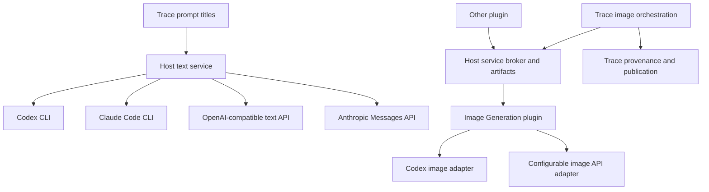

# Shared AI services and Image Generation plugin: implementation plan

Status: **plan only; implementation has not started**.

Prepared: 2026-10-10, Australia/Sydney.

Intended implementer: Sol, working across the Tauri Explorer host and this repository.

## 1. User request and scope

Implement two related changes:

1. Extract image generation from TraceExplorer into an independently installable **Image Generation** plugin. Other plugins must be able to consume its generation/editing service. Image connections need configurable API base URLs, credentials, and models.
2. Add a **global Tauri Explorer language-model service**, defaulting to Codex, that TraceExplorer uses for prompt summarization. It must also support Claude and configurable providers such as DeepSeek. Do not implement this as a Codex/Claude-only enum with no custom endpoint support.

The user explicitly requested this detailed Markdown plan before implementation. This document does not authorize publishing releases, installing them into the user's running application, making paid test requests, or modifying repositories as part of the planning turn. On the subsequent implementation turn, follow that turn's authorization and the repositories' AGENTS.md instructions.

### Required user-visible outcomes

- Configure a text provider once in Tauri Explorer, independently of any image connection.
- Select Codex CLI, Claude Code CLI, an OpenAI-compatible text API, or the native Anthropic Messages API.
- Enter custom API base URLs and model identifiers, including DeepSeek and compatible local endpoints.
- Have new Trace prompt titles use the selected global text connection.
- Keep the original prompt readable if summaries are disabled or generation fails.
- Configure image connections in the Image Generation plugin, without putting API keys in TraceExplorer requests.
- Generate/edit through TraceExplorer with the same ordered inputs, provenance, history, batch grouping, cancellation, retry, and save behavior as before.
- Let a second plugin consume image generation without importing TraceExplorer or requiring its database.
- Keep Trace history/viewing usable when the Image Generation plugin is missing, disabled, or incompatible. Only the generation feature depends on it.

### Explicit non-goals for the first implementation

- Migrating every existing host AI feature, such as AI Rename or AI Organize, to the new text service. Make that possible, but Trace prompt titles are the first consumer.
- Making every text provider an image provider. Text protocol compatibility says nothing about image generation support.
- An agent framework, chat UI, arbitrary tool execution, browser automation, or a generalized workflow engine.
- Automatic provider failover, automatic paid image retries, speculative title generation, or model recommendations/pricing UI.
- Automatic plugin downloading or a plugin marketplace/dependency solver. Missing dependencies get actionable diagnostics and the existing installation flow.
- A new image editor or visual redesign of TraceExplorer.
- A promise of exactly-once execution at a remote provider. The achievable guarantee is no automatic replay of an operation that may already have reached that provider.

## 2. Repository baseline: verify before editing

These observations come from local source inspection. They are a starting point, not a substitute for checking the current target branch.

| Repository | Inspected branch | Inspected commit |
| --- | --- | --- |
| TraceExplorer | `main` | `cae90fb4344375cf8fc1453df74f50ecdc0b4d55` |
| tauri-explorer | `dev` | `7adee7054341e248bf97713bf20a8824f26ad3a7` |

TraceExplorer's inspected manifest is version `0.2.3`, SDK 2, Svelte ABI `5.56.3`. The host's manifest parser currently accepts SDK 1 and 2.

Both checkouts contained unrelated untracked files, including `.worktrees/`. Do not delete, stage, or incorporate them.

At implementation start:

1. Read both repositories' current AGENTS.md files and relevant nested instructions.
2. Check branch status and the real target tips. Host work branches from `dev`; Trace work targets `main` unless its instructions have changed.
3. Use isolated branches/worktrees. Verify `git merge-base HEAD <target>` against the target's actual tip before starting and again before integrating delegated work.
4. Follow the host's issue/branch, evidence, and code-map requirements. Do not silently turn its `dev` checkout into a feature branch or edit unrelated work.
5. Check what changed since the commits above before copying code or designing migrations around a schema.
6. Use **bun only** for JavaScript tooling. Do not translate repository instructions into npm/yarn/pnpm commands.

### 2.1 What exists in TraceExplorer

| Existing path | Current responsibility / relevant constraint |
| --- | --- |
| `plugin.json` | One package, `xnmp.trace-explorer`, with `trace` and `openai-image` contributions; owns `trace.sqlite`. |
| `src/index.ts` | Frontend package entry; inspect activation and backend binding before changing contribution ownership. |
| `src/lib/plugins/openai-image/index.ts` | Registers image settings, dialog, editor tool, history, commands and context menus; also binds prompt titles. |
| `src/lib/plugins/openai-image/image-jobs.ts` | Registers host-visible jobs and retry actions. |
| `src/lib/plugins/openai-image/OpenAIImage*.svelte` | Current editor/dialog/history surfaces; retain their interaction behavior. |
| `src/lib/domain/image-generation-settings.ts` | Image option rules. |
| `src/lib/domain/image-retry.ts` | Reconstructs retries from recorded runs, including pinned input digests. |
| `src/lib/plugins/trace/prompt-titles.svelte.ts` | Title queue, connection probing, reactive labels, settings subscription and stale-result guards. |
| `src/lib/api/openai-image.ts` | Image backend wrappers; request currently includes `backend` and `codexPath`; start also receives `apiKey`. |
| `src/lib/api/common.ts` | Routes frontend requests to this package's bound backend. |
| `src-tauri/src/protocol.rs` | Plugin methods, initialization and job RPC. |
| `src-tauri/src/openai_image.rs` | Mixed orchestration/provider code: validation, captured inputs, recipe, HTTP transport, response validation and starting recorded jobs. Hard-coded API root. |
| `src-tauri/src/openai_image/codex.rs` | Codex image generation and text-title generation in the same adapter. |
| `src-tauri/src/openai_image/codex_executable.rs` | Desktop CLI discovery, including common Node installation locations; preserve cross-platform behavior. |
| `src-tauri/src/openai_image/codex_turn.rs` | Codex event interpretation, image outcome/error diagnostics. |
| `src-tauri/src/host_process.rs` | Backend-to-host RPC transport and owned process adapter. Replies use string IDs prefixed `host:`. |
| `src-tauri/src/main.rs` | Stdio reader, bounded request dispatch, host-reply routing and chunked outbound responses. |
| `src-tauri/src/trace/titles.rs` | Loads the authoritative full prompt from `runs`, caches title by prompt digest, calls the Codex title adapter. |
| `src-tauri/src/trace/jobs.rs` | Durable image acceptance keyed by operation ID and request digest; duplicate acceptance does not repeat provider work. |
| `src-tauri/src/image_operation.rs` | Existing output staging, publication proof and terminal settlement. |
| `src-tauri/src/temporary_output.rs` | Generated output storage and save suggestions. |
| `src-tauri/src/trace.rs` and `src-tauri/src/trace/*` | SQLite schema, recovery, provenance, folder index, save/discard and history. |
| `integration/plugin-sdk/index.d.ts` | Mirrored host contract; do not invent a plugin-only API here. |
| `integration/README.md` | Current host capability and lifecycle documentation. |
| `scripts/package-plugin.py`, `.github/workflows/ci.yml` | Package build/checksum and five-target CI. |

Current title settings are `titleGenerator`, `titleCodexPath`, and fallback `codexPath`, stored with the `openai-image` contribution. `titleGenerator === "disabled"` prevents requests. The inspected title adapter uses a hard-coded model, isolated temporary cwd, bounded process output and a 45-second deadline. Treat those as existing behavior to migrate, not a specification for every future adapter.

### 2.2 What exists in the host

Paths in this subsection are relative to `/home/chong/Repos/tauri-explorer`.

| Existing path | Relevant responsibility |
| --- | --- |
| `src/lib/plugins/api.ts` | PluginContext, plugin storage, registration/disposal. No cross-plugin service API at the inspected commit. |
| `src/lib/plugins/installed.ts` | Installed package frontend loading, backend binding, refresh/enable/disable. |
| `src/lib/plugins/registry.svelte.ts` | Contribution activation/lifecycle. |
| `src/lib/plugins/runtime-sdk.ts` | Runtime SDK modules/capabilities. |
| `src/lib/plugins/settings-registry.svelte.ts` | Descriptor-driven contribution settings; currently ordinary plugin storage. |
| `src/lib/components/SettingsDialog.svelte` | Host settings shell/search; global AI settings should be reachable here. |
| `src/lib/state/settings.svelte.ts` | Existing global settings conventions. |
| `src/lib/api/config.ts`, `src-tauri/src/config.rs` | Config IO; inspected Rust code makes config owner-only on Unix, but this is not an OS secret store. |
| `src-tauri/src/installed_plugins/package.rs` | Strict manifest parsing (`deny_unknown_fields`), SDK and payload validation. No service/dependency fields yet. |
| `src-tauri/src/installed_plugins/backend.rs` | One broker per package, reverse `host.process.*` requests, job IDs, operation IDs, recovery and owned subprocesses. |
| `src-tauri/src/installed_plugins/lifecycle.rs` | Transactional upgrade, declared state snapshots, preflight and rollback. |
| `src-tauri/src/installed_plugins/provenance.rs` | Generic host provenance integration and active publisher leases. |
| `src-tauri/src/installed_plugins/mod.rs` | Install/disable/remove and lifecycle locking. |
| `src-tauri/src/process_ext.rs` | Owned/cancellable native process execution. |
| `docs/code-map/map-feature.md`, `map-folder.md`, `map-playbook.md` | Required cross-layer maps and change recipes. |

Critical inspected transport behavior:

- Host-to-plugin request frames are limited to **1 MiB**.
- `Broker::call` waits **60 seconds**; a deadline failure can stop the backend before acceptance recovery.
- `jobs.start` allocates a host job ID and operation ID, then performs status recovery if the reply is lost.
- On backend death, current host recovery restarts the consumer, reads `jobs.status` once, and emits an error for anything other than a succeeded status with an output path. That is incompatible with the new requirement to transfer ownership to host recovery, request provider cancellation and reconcile the winning outcome; section 10.4 explicitly changes it.
- `busy()` currently considers jobs, provenance leases and recovery, not arbitrary future service operations.
- Initialization advertises `processService` and active provenance run IDs. Generic service/LLM capabilities do not exist yet.
- Frontend plugin storage is scoped by **contribution ID**, while backend/installation ownership is scoped by **package ID**. Do not confuse `openai-image` with `xnmp.trace-explorer` in migrations.

## 3. Architectural decisions

### 3.1 Responsibility boundary

| Component | Owns | Must not own |
| --- | --- | --- |
| Host global LLM service | Text profiles, text adapters, secret references, limits, cancellation, settings revision | Trace titles, Trace DB, image model/options policy |
| Host plugin infrastructure | Declared service routing, lifecycle leases, caller identity, bounded artifact exchange | Image HTTP protocol, Trace graph rules |
| Image Generation plugin | Image profiles, image adapter capabilities, provider execution, durable provider receipts | Trace database, Trace selection, output-folder policy, user-file publication |
| TraceExplorer | Prompt-title recipe/cache, original prompts, immutable input provenance, image operation orchestration, graph/history, save/publication | API keys, API URLs in frontend provider calls, CLI/provider transport implementations |



The text service is built into the host and remains available without either plugin. Image Generation is a normal independent package. It must not depend on TraceExplorer, directly or through its initialization, events, storage or settings.

### 3.2 Repository/package layout

Recommended first implementation: retain two source repositories and build two installable packages from the TraceExplorer repository. Put the new package under `plugins/image-generation/`, with its own frontend entry, manifest and Rust backend crate. This avoids making an unrequested third GitHub repository a prerequisite.

Suggested new layout (all **proposed**, not existing):

```text
TraceExplorer/
  plugins/image-generation/
    plugin.json
    src/index.ts
    src/settings/...                 # image connection management
    backend/Cargo.toml
    backend/src/main.rs
    backend/src/protocol.rs
    backend/src/domain/...           # request/options/receipt rules
    backend/src/adapters/...          # Codex and images HTTP API
    backend/src/operations/...        # provider journal and execution
  integration/services/
    image-generation-v1.ts           # canonical TS service contract
    fixtures/...                    # shared wire examples
  crates/plugin-runtime/             # only if extraction avoids real duplication
  scripts/package-image-generation.py
```

Proposed package identity: `xnmp.image-generation`; settings contribution identity: `image-generation`. Confirm no collision with installed/built-in contributions before finalizing. The existing `~/Repos/image-generation` directory is unrelated inspected local material; do not repurpose it based on its name.

Extract only genuinely common stdio framing, reverse host RPC and process ownership into a small shared runtime crate if needed. Do not make the new plugin depend on the Trace backend crate, and do not create a broad SDK/framework to avoid a few local types. No circular Cargo dependencies.

Keep existing Trace dialogs/editor actions in TraceExplorer for this release. The new provider package supplies settings plus a service; it need not contribute a duplicate Generate command. An independent test consumer proves reusability. Rename visible OpenAI-only labels where they become misleading, but preserve command/contribution IDs where that avoids losing user shortcuts/preferences.

### 3.3 Protocols, capabilities and versions

- Provider brand, transport protocol, model ID and service version are separate concepts.
- A text profile using an OpenAI-compatible endpoint does not automatically support Responses, strict JSON Schema, reasoning controls, images, streaming or model discovery.
- Use a small fixed set of adapters with user-editable connection values. Do not implement runtime-loaded provider code.
- All new public methods, capabilities and wire shapes originate in the host contract, then are mirrored into the plugin SDK.
- Retain old SDK support in the host. For the final split packages, introduce SDK 3 if needed to make the new manifest/service requirements explicit. Existing SDK 1/2 packages still load.
- Continue capability detection at runtime; do not scatter host semantic-version comparisons through Trace components.
- During the earlier title-only phase, a SDK 2 Trace build can detect the new LLM capability and degrade to original prompts on old hosts.
- The final SDK 3 image split must fail installation clearly on an old host; do not advertise unsupported compatibility or silently ship two competing generation paths.

## 4. Global text connection design

### 4.1 Configuration ownership

Store a versioned host-owned document such as `ai-connections.json`. It holds public profile metadata and a selected text profile ID. It is independent of plugin storage and ordinary UI settings snapshots. Use the host's atomic/serialized config conventions, with native validation and revisions to prevent cross-window lost updates.

Proposed domain shape; names may change together before contract freeze:

```ts
type TextTransport =
  | "codex-cli"
  | "claude-code-cli"
  | "openai-chat-completions"
  | "anthropic-messages";

type CredentialSource =
  | { kind: "none" }
  | { kind: "secret"; id: string }
  | { kind: "environment"; name: string };

interface TextConnectionProfile {
  id: string;                         // stable opaque ID; rename does not change it
  name: string;
  transport: TextTransport;
  model: string;                      // user-editable, bounded, never a closed brand enum
  baseUrl?: string;                   // HTTP transports only
  executablePath?: string;            // CLI transports only
  credential: CredentialSource;       // HTTP; CLI saved-login remains CLI-owned
  timeoutMs: number;
  // Add only tested, typed adapter-specific options, not arbitrary command flags.
}

interface TextConfiguration {
  schemaVersion: 1;
  revision: number;                   // CAS/read revision for UI saves
  enabled: boolean;
  defaultProfileId: string | null;     // null allowed only when disabled
  profiles: readonly TextConnectionProfile[];
}
```

Use a discriminated union in production so impossible combinations are rejected; the compact interface above only illustrates common fields. New installations start enabled with a Codex CLI profile. Absence of Codex is an availability error, not permission to choose another provider. A model default must be verified against current CLI support at implementation time; do not invent or perpetuate an unavailable model because it appears in this checkout.

Support multiple saved profiles and exactly one active global default when enabled. An enabled configuration must reference an existing profile. A disabled configuration may retain a valid selected profile or have `defaultProfileId: null`, including an empty profile list. Re-enabling requires selecting/creating a valid profile; do not silently recreate a deleted profile or select an arbitrary remaining one. Express these invariants as a discriminated union in production and native validation. First release consumers use that default. Keep per-feature provider overrides out of Trace until requested; they undermine the requested global setting.

### 4.2 Credentials

- API keys are submitted through a write-only settings command and replaced/cleared explicitly.
- Read responses contain `hasCredential` and source metadata, never secret contents or masked strings that can accidentally be saved as keys.
- Use OS-backed secret storage through a small host abstraction, with an injectable in-memory test implementation. Verify actual Linux Secret Service, macOS Keychain and Windows Credential Manager support/dependencies before choosing the library.
- If the OS store is unavailable/locked, return a clear configuration error and support an explicitly selected environment-variable source. Do not silently persist a new key in plaintext.
- A secret has an owner/profile association. Generic consumers cannot read arbitrary secrets. Image Generation may resolve only its own image-profile credentials via a narrowly scoped native service.
- Environment variable names are validated; resolve values only in the backend and never echo them.
- Do not harvest Codex/Claude login tokens. Their CLI adapters use supported saved-login behavior.
- Deleting a profile/key while work is active must not redirect that work. Snapshot the effective configuration/credential into the executing backend operation; new requests see the new revision.
- Provider metadata/history must exclude keys, authorization headers and secret-bearing URL components. Config exports must exclude secret values.

Existing config-file owner permissions are useful, but do not call them encrypted/secure credential storage. Generic frontend plugin storage currently permits raw key values; the new flow must avoid extending that practice.

Key mutation and configuration revision must be coordinated. Prefer immutable secret records: set/replace creates a fresh secret ID, verifies it, then conditionally commits the new profile reference/revision; old in-flight admissions retain their captured credential. A failed CAS leaves an unreferenced new secret to clean up, not an overwritten old credential. Clear commits a no-credential reference/revision before retiring unused old records. Do not overwrite a shared secret-store slot before the profile revision changes and allow a concurrent old-revision admission to read the new key. Credential-only edits advance execution/configuration revision even though title-cache fingerprints intentionally exclude secret values.

### 4.2a Durable configuration writes and parse failures

The current host config helper provides useful naming/symlink/permissions conventions, but its flush/rename behavior is not proof of a durable cross-platform revision commit. The new configuration/ledger/migration layer must explicitly provide:

- CAS validation, serialization, bounded temporary write, file sync, platform-correct atomic replacement and revision commit under one native coordination mechanism. Sync the containing directory where supported and document platform limitations honestly.
- A tested Windows replacement path; do not assume POSIX rename-over-existing behavior. Keep inherited Unix owner-only permissions and platform credential/config access controls.
- Committed-change events only after durable state is readable, never before a write finishes.
- Distinct states for genuinely absent first-run config, malformed file, unsupported newer schema, unreadable storage and interrupted replacement. Only genuinely absent config creates defaults; other failures keep the feature unavailable until repaired without silently enabling a default endpoint.
- Explicit symlink policy: new host-owned ledgers/artifact metadata use private non-symlink controlled storage; ordinary legacy config may intentionally point to an external canonical target and migration must respect its existing safe write semantics. Do not blanket-break existing symlinked user config or follow arbitrary links inside private service state.
- Profile-wide coordination across all processes that can touch the same config directory. A static Rust mutex only coordinates one process. Verify the host's actual owner-lock model on Linux, macOS and Windows; add a tested file/transaction lock where necessary rather than assuming every “window” shares a process.

Keep hardening focused on the new service/config durability contract and migration boundaries. Do not rewrite unrelated host settings behavior without separate evidence.

### 4.3 URL/model validation

- Use URL parsing and one adapter-owned endpoint builder. Preserve user base path prefixes and normalize trailing slashes. Never concatenate paths independently in several callers.
- Document base URL semantics: it is the API root **including any required version/prefix**, e.g. `https://example.test/v1`; the chat adapter appends `chat/completions` and the messages adapter appends `messages`.
- Presets provide the correct root for their protocol. Custom profiles follow the same semantics. Test roots with and without a trailing slash and with nested prefixes; avoid duplicate `/v1` or `/images`.
- Reject fragments, embedded usernames/passwords and secret query parameters. Prefer rejecting query strings in v1 rather than allowing arbitrary credentials in them.
- Require HTTPS except explicitly configured local/private HTTP endpoints. If non-loopback HTTP is supported, make insecure transport an explicit profile setting rather than silently assuming it is safe.
- Disable automatic HTTP redirects for authenticated calls; never forward a credential to a changed origin.
- Model IDs are bounded strings, not a list of current OpenAI models. Empty/unknown models produce actionable validation/provider errors, not silent substitution.
- Do not require `/models` to exist. Manual entry is always supported. Discovery, if added, is optional and cannot block a valid profile.

### 4.4 Adapter behavior

| Adapter | Required behavior |
| --- | --- |
| Codex CLI | Desktop discovery/custom executable, supported saved login, isolated working directory, no tools/project instructions, bounded process output, owned cancellation, explicit model. |
| Claude Code CLI | Supported headless invocation and saved login, equivalent tool/config isolation, bounded result extraction, owned cancellation and explicit model. |
| OpenAI-compatible Chat Completions | System/instruction plus user data messages, selected model, non-streaming response, bounded output; DeepSeek/custom roots supported without brand checks. |
| Anthropic Messages | Native request/response shape and required version/auth headers; only text output accepted by this service. |

Do not copy remembered CLI flags into production. Verify current official CLI documentation and the installed executable's help, then add fixture-based argument/output tests. Account/config isolation differs between CLIs. If a supported CLI cannot disable external tools/config safely, mark that adapter unavailable with an actionable reason instead of allowing agent execution for a title.

Use the existing owned process implementation rather than `Command::output()` or shell-string execution. Preserve Windows launcher/no-console behavior and process-tree cleanup. Pass prompt data via a supported stdin/file mechanism where available; do not interpolate it into a shell. Bound both stdout and stderr.

Do not force strict JSON Schema or a `temperature`/reasoning parameter onto every endpoint. Plain text is sufficient for titles. Normalize final text only; never treat a reasoning/thinking block as the title.

### 4.5 Settings UX

Add a focused host component reachable from **Settings → AI → Language models**. Keep state and async coordination out of the component.

Controls:

- Global enabled switch; default profile selector.
- Add, rename, edit and delete profiles; prevent deletion of the active profile without choosing a replacement or disabling text generation.
- Protocol/preset selection; relevant base URL/model or executable fields.
- Credential source, replace/clear key, presence indicator.
- Timeout with a bounded range.
- **Check connection** for structural/local authentication checks; **Test generation** for an explicit minimal request if needed. Do not describe a filesystem/CLI-presence check as proof that the model can generate text.
- Clear pending/success/error states. Stale test results must not overwrite newer edits or another profile's status.
- Search terms include AI, LLM, language model, Codex, Claude, DeepSeek, endpoint and API key.

Selecting a text profile must not modify image settings. Saving a key must not cause generation. Native profile-change events refresh every window after a committed save.

## 5. Host text service contract

### 5.1 Domain operations

Expose a versioned service, proposed name `host.text.v1`, to core host consumers and plugin backends. A frontend facade may expose status/settings and cancellation, but backend title generation should not round-trip its full prompt through the renderer.

```ts
interface TextRequest {
  requestId: string;                   // bounded caller-unique request/cancellation ID
  instructions: string;
  input: string;
  maxOutputTokens: number;
  timeoutMs?: number;                  // can only tighten host policy
  expectedConfigurationRevision?: number;
}

interface TextResult {
  text: string;
  context: {
    profileId: string;
    configurationRevision: number;
    fingerprint: string;               // effective non-secret generation context
    transport: TextTransport;
    requestedModel: string;
    actualModel?: string;
  };
  usage?: { inputTokens?: number; outputTokens?: number };
}
```

Also define `describe`/availability and `cancel`. Errors are typed: `disabled`, `not_configured`, `unavailable`, `invalid_request`, `configuration_changed`, `authentication_failed`, `rate_limited`, `timed_out`, `cancelled`, `invalid_response`, `capacity_reached`, `provider_failed`. Return safe messages and optional retry timing, not raw HTTP/CLI logs.

### 5.2 Execution and ownership

- Identify a backend caller from its native broker. Do not accept caller identity/ownership from JSON fields supplied by a plugin.
- Use a composite identity `(caller incarnation, requestId)` for live text requests. Two plugins can use the same request ID without collision.
- Snapshot configuration at admission. An expected revision mismatch fails before contacting a provider.
- Bound input, instructions, output, active concurrency and queue length. Proposed initial policy: 64 KiB combined UTF-8 input/instructions, at most 4 active host text requests and 32 queued; a bounded per-caller quota prevents one plugin consuming all slots. Tighten for titles below.
- A total deadline includes queueing; do not let a full queue add unbounded delay to a 45-second title request.
- Reverse RPC handling must continue reading frames while text work runs. Never block the broker reader on provider IO.
- Text completion deadline must fit the surrounding plugin RPC deadline. Keep Trace titles at no more than 45 seconds total while the existing outer call has a 60-second limit. If a future consumer needs longer work, introduce start/status/cancel for it; do not just lengthen every broker timeout.
- Caller/backend death and host shutdown cancel owned text work and CLI descendants. Native HTTP cancellation/deadlines must not leave unlimited blocking workers behind.
- A profile switch changes subsequent admissions. It does not mutate the endpoint/model mid-request. The consumer uses the returned revision to reject stale display results.
- For v1, do not automatically retry generation on transport errors. A manual test or future explicit retry policy can be added separately.
- In-memory request state is sufficient for short text generation. Do not build a persistent text job system merely to generate titles.

### 5.3 Configuration fingerprint

Compute a stable hash from the canonical effective non-secret generation context: adapter/protocol version, API root or CLI configuration identity, model, and output-affecting adapter settings. Exclude profile display name, API key, credential rotation, timestamps and unrelated image settings. Separately maintain the mutable configuration revision for races.

CLI account/config changes may not be perfectly detectable. Document the actual identity contract rather than claiming the fingerprint detects external edits to CLI config. Explicit profile edits and a manual title refresh must invalidate the consumer's generation context when appropriate.

### 5.4 Concrete integration surfaces to freeze in Stage A

Proposed capability names are `textGeneration`, `pluginServices` and `serviceArtifacts`. Keep runtime capability strings, native initialization fields, TS types, fixtures and documentation synchronized. The names are provisional until Stage A, but one canonical spelling must then be used everywhere.

| Direction | Proposed surface | Purpose |
| --- | --- | --- |
| Host settings UI → native | `ai_connections_read`, `ai_connections_save` | Sanitized config reads and expected-revision writes. |
| Host settings UI → native | `ai_connection_set_credential`, `ai_connection_clear_credential` | Write-only secret mutations bound to a concrete profile and expected revision. |
| Host settings UI → native | `ai_connection_check`, `ai_connection_test`, `ai_connection_cancel_test` | Local availability/auth checks versus explicit test generation. |
| Native → host windows | `ai:text-configuration-changed` | Committed revision notification, without credentials or prompts. Consumers reread sanitized state. |
| Plugin backend → host | `host.text.describe` | Current enabled/configured status, public selected profile, configuration revision and fingerprint. |
| Plugin backend → host | `host.text.generate` | Execute a bounded `TextRequest` under the calling broker's ownership. |
| Plugin backend → host | `host.text.cancel` | Cancel one request belonging to this caller incarnation. |
| Plugin frontend → host | Optional `ctx.text` facade | Sanitized availability/configuration subscription; no raw native invoke import or secret access. |

The service name `host.text.v1` denotes the logical contract; the concrete reverse-RPC method names above are its wire operations. Version negotiation is part of initialization/describe, not inferred from whether an unknown method happens to return an error.

Extend Trace's initialization to learn these native capabilities before accepting dependent requests. Generalize its existing reverse RPC transport into a small host client rather than making text calls invoke the private `host_process` process helper. Preserve distinct inbound numeric request IDs and outbound `host:` reply IDs, robust disconnect behavior and bounded frames.

The host does not currently broadcast native config events to every plugin backend automatically. Choose and implement one notification path: frontend `ctx.text` subscribes and asks its Trace backend to invalidate local context, while each backend generation still checks the current native revision at admission. Correctness must not depend on the event arriving before the next request. A backend without a frontend can always call `describe`/send an expected revision; do not require a UI for the service to work.

## 6. Trace prompt-title migration

### 6.1 Backend changes

Keep `trace_prompt_title` as a Trace domain operation. It still accepts a run ID, loads the **full persisted prompt**, enforces the current 16,000-byte prompt limit, applies the title recipe, validates the result and writes the cache.

Replace `crate::openai_image::prompt_title(...)` with a host text-service client. Remove `codexPath` from the new title request contract. A host capability determines availability; image credentials and image-provider availability are irrelevant.

Prompt recipe requirements:

- Ask for a concise 2–6 word title in the prompt's language where appropriate.
- Treat the supplied prompt as data, not instructions, and ask for title text only.
- No filesystem access or tools.
- Validate nonempty one-line output with a small character bound (e.g. 120 Unicode scalar values). Do not enforce English word counting on languages that do not use spaces.
- Reject reasoning dumps, structured wrappers that cannot be safely normalized, or huge/malformed output. Fall back to the original prompt; do not produce misleading truncated garbage.
- Use a small output budget and the currently supported fast model configured by the user; the feature must not silently override their model choice.

### 6.2 Cache schema and compatibility

Current `image_prompt_titles` is keyed only by prompt digest. Add a new versioned cache table keyed by `(prompt_digest, recipe_version, context_fingerprint)`, recording profile/model metadata where useful. Additive migration is preferable to rewriting/deleting the old table.

Obtain the effective context from host `describe`, request against its configuration revision, then only store under the actual matching response context. A settings change between describe and execute must not mislabel the cache entry. Deduplicate requests by the full cache key, including across windows/backend calls. Do not hold a SQLite transaction/connection lock over provider IO.

Legacy cache policy:

- Preserve the old table and original prompts during upgrade and rollback.
- Only import an old entry into a new context when migration can positively identify the same legacy title recipe/model/connection semantics. Do not label an old Codex title as DeepSeek output.
- Otherwise leave it as legacy stored data; use the original prompt until a new-context title is generated. Preserving data does not require showing a stale title under every future provider.
- Do not eagerly regenerate all historical titles on migration/provider change. Generate on the existing demand-driven path.

### 6.3 Frontend state/lifecycle

Refactor `prompt-titles.svelte.ts` to subscribe to host text configuration/status plus a Trace-owned `summarizePrompts` preference. Binding belongs to the Trace contribution, not the image-provider contribution.

Preserve deduplication, sequential bounded demand, null/blank filtering and original-prompt fallback. On reconfiguration/unbind:

1. Increment the request generation/revision.
2. Cancel owned active requests where supported and clear queued work.
3. Clear context-specific in-memory labels/pending state so the old provider's title does not survive as if generated by the new provider.
4. Ignore late results and late connection probes.
5. Allow demand to retry under the new context, while avoiding infinite retries for a failed request in one unchanged context.

Cache hits should not require a new live network authentication probe for every label. Local configured status is distinct from proven remote availability. Missing host capability or disabled service must be a quiet fallback to original prompts, not a modal/toast per run.

Remove the old title executable fields from normal image settings after migration. Keep a single Trace summary enable/disable control and a link to global language-model settings.

The new preference has a concrete destination: contribution `trace`, file `plugin.trace.json`, key `summarizePrompts: boolean`. Before the new Trace title binding reads this store, the host-native `trace-summary-v1` migration copies `plugin.openai-image.json.titleGenerator === "disabled"` to `false`, and other/missing legacy values to the established enabled default, **only if the destination key is unset**. A user-set destination `true` or `false` always wins. Use native conditional read/merge/write and an import marker so concurrent windows cannot overwrite a newly changed choice. Test disabled legacy state even when Image Generation has never been installed. Keeping the old field in the old contribution file is not sufficient after ownership moves.

Stage C removes/redirects the old title fields in both registered and inline image settings while retaining still-needed legacy image settings until Stage F. Give summary-preference migration and later image-provider migration different markers/cutover gates. Retire legacy title fields only after destination evidence is committed; do not make title migration wait for image-provider availability.

## 7. Cross-plugin services in the host

### 7.1 Manifest additions

Use explicit exports and consumer declarations. A proposed minimal manifest fragment:

```json
{
  "sdkVersion": 3,
  "services": [
    {
      "id": "image-generation",
      "major": 1,
      "methods": ["describe", "prepare", "start", "status", "cancel", "acknowledge"]
    }
  ],
  "serviceDependencies": []
}
```

Trace's final manifest declares:

```json
{
  "sdkVersion": 3,
  "serviceDependencies": [
    {
      "packageId": "xnmp.image-generation",
      "serviceId": "image-generation",
      "major": 1,
      "optional": true
    }
  ]
}
```

`optional` means the package may activate without the service; it does not mean generation may silently use some other provider. A required dependency blocks activation with a clear reason. Major protocol version, package version and per-provider image capabilities are distinct.

Validate identifiers, lengths, duplicate declarations, method names, unsupported majors and dependency cycles. Reject self-dependencies. Require exact package selection; do not pick the first exporter found. No full package semver resolver is required for v1; a major-version service contract plus advertised capabilities is enough.

Update both Rust and frontend manifest types, validation, fixtures and builders. Because current manifests deny unknown fields, do not add fields only to plugin JSON and expect older hosts to ignore them.

### 7.2 Routing contract

Proposed reverse host methods: `host.services.describe` and `host.services.invoke`. A call identifies the declared target package/service/major and an exported method with bounded parameters. Route only to a host-constructed provider dispatch name, such as `services.image-generation.v1.start`.

- Never expose arbitrary target backend methods, `initialize`, `lifecycle.*`, `jobs.start` or unrestricted `host.*` forwarding through this API.
- The host derives caller package/incarnation and attaches trusted caller context to the provider request. Reject spoofed ownership fields.
- Give builtin host services separate routing from plugin exports; a package cannot impersonate `host.text.v1`.
- Provider availability comes from enabled installed packages and declared exports, independent of frontend contribution load order.
- Package enablement and contribution enablement are different. An enabled `xnmp.image-generation` package continues serving even if its `image-generation` settings contribution is disabled; the latter hides/disposes its frontend settings/dialog only. Keep the existing contribution toggle semantics for v1, label it clearly as settings UI, and direct a configuration-edit action to enable that contribution if necessary. A disabled package cannot serve at all. Test both toggles separately and do not label a settings-only toggle as “image generation disabled.”
- Required dependency activation order is deterministic. Optional missing providers do not prevent Trace view startup.
- The reader thread routes and schedules work; it must never wait synchronously for a provider that itself needs a reverse host call.
- Audit lock order. Do not hold a global broker-map/startup/lifecycle mutex while waiting for provider IO or callbacks. Reserve a concrete provider generation under a short critical section, then execute with an owned lease.
- Do not claim a security sandbox between native plugins or JS in a shared webview. The identity/ownership checks prevent routing mistakes and confused ownership; a malicious native plugin already has user-level OS capabilities.

### 7.3 Lifecycle

Extend busy/drain/recovery ownership to service operations, not just frontend jobs. Distinguish package-generation lifecycle/execution claims, artifact/evidence references and durable replay-prevention tombstones. Accepted/running operations and succeeded-but-unacknowledged deliveries retain **both** a consumer-package claim and a provider-package claim, including their pinned digests and the logical operation/service identity. A terminal unknown outcome may release execution claims only when no live owned worker remains and durable needs-attention/evidence state exists; artifact/evidence references then follow the delivery and orphan-resolution policies. Tombstones alone never keep a package busy. Lifecycle mutation must consult active claims in either role, even when no frontend or broker is currently running:

- Admission pins the provider package digest/incarnation and the caller's operation ownership.
- Disable/remove/upgrade first closes admission, then follows the existing wait/refuse-while-busy behavior for accepted operations. Never swap a running operation to a new provider binary.
- Current disabling only updates installed enablement; it does not already provide the required busy/drain/native-retirement behavior. Implement that extension explicitly: refuse/defer a busy disable, and after a safe disable atomically stop routing and retire the backend. Recheck enabled generation when acquiring every call lease, not only during `describe`.
- An accepted image operation keeps the relevant provider state/artifacts alive until it is terminal and its result has been handed off or explicitly reconciled.
- Provider death fails outstanding transport calls promptly; callers recover through status, never by blindly repeating start.
- For accepted durable image work, a consumer-backend crash transfers live ownership to the host recovery owner and requests cancellation, then reconciles the winning outcome (which may already be success). It does not immediately revoke granted result access or erase receipts. A form/window disappearing alone is not a consumer-backend crash. Short text/unaccepted work is cancelled under its transient owner policy.
- Host shutdown stops admission, cancels processes, persists uncertainty and leaves recoverable artifacts intact.
- Runtime service handles are incarnation-bound; durable operation identities are not. A stale live handle must fail; a fresh broker can look up the same durable operation ID.
- A succeeded-but-unacknowledged delivery pins both participating package generations until safe handoff/discard/reconciliation. Terminal tombstones alone do not keep a package busy. An unknown outcome with no live owned process may release execution leases only after durable needs-attention/evidence state is recorded; retained bytes/references follow the separate delivery policy and explicit orphan-resolution path in section 21.

Service operations must not reuse the host's `jobs.start` allocation path for each nested provider call. Trace already owns the user-visible host job. Allocate one logical image operation and carry its identity through the provider layer; do not create duplicate progress entries or operation IDs.

### 7.4 Identity and durable admission ledger

Name these identities separately in code and tests:

| Identity | Lifetime / use |
| --- | --- |
| Package ID | Stable installation/data owner, e.g. `xnmp.trace-explorer`. |
| Contribution ID | Frontend commands/settings owner, e.g. legacy `openai-image`; not a credential or backend authority. |
| Broker incarnation | One process lifetime; scopes live reverse requests/cancellation and rejects stale messages. |
| Package digest | Exact installed binary/frontend payload; pin during active operations. |
| Host job ID | User-visible progress registration; already allocated for the Trace job. |
| Logical operation ID | Durable idempotency identity carried from Trace through host to provider; survives process restart. |
| Provider receipt key | Trusted consumer package + logical operation ID. |
| Artifact handle | Opaque storage identity plus server-verified grants; never a filename chosen by the caller. |
| Connection ID/revision | User connection identity and exact configuration selected at submission. |

For accepted image-service operations, the host needs a durable admission record tying consumer, provider package/service major, operation ID, request identity, pinned provider generation, input grants and result references together. This record is infrastructural; it must not duplicate Trace run/graph data or become another source of provider outcome truth.

Use explicit phases such as `reserved`, `forwarding`, `accepted`, `terminal`, `released`. Persist `forwarding` before sending start; after a crash in/after that phase, recover by provider status, not a second start. The names are internal, but their meanings and legal transitions must be tested. There is no distributed transaction across Trace SQLite, host ledger and provider SQLite: each step requires its own idempotent durable record and conservative recovery for an unknown next step.

If the host proves a record never left `reserved`, it can settle it without a provider call and release unaccepted grants. A missing provider receipt after `forwarding` is not by itself proof of nonexecution: provider recovery/rollback/unavailability must be resolved first. For v1, mark unresolved cases pending/unknown rather than automatically resend.

Do not garbage-collect all terminal host records when artifacts are released. Retain enough tombstone/idempotency evidence to prevent an old operation ID from being treated as new. Provider receipt tombstones carry the same requirement. Define retention as durable for this release; any later bounded retention scheme must also prohibit old-ID reuse explicitly.

Before accepting a new operation, provider receipt state, host input-grant ownership and the selected profile must all be valid. When provider acceptance succeeds but the host acknowledgement is lost, status reconciliation reestablishes the host's lease from the receipt. Every cleanup path checks both ledgers' recovery state rather than trusting an in-memory counter.

### 7.5 Startup, preflight and activation are different states

Reconstruct durable service/artifact claims **before** permitting package mutations or starting the pending-plugin installation worker. Current host startup runs upgrade recovery and then starts queue processing without such a durable service ledger; it needs an explicit ordering change.

Proposed required sequence:

```text
service admission and package mutation closed
  → read/validate host ledger and interrupted-upgrade journal
  → reconstruct consumer/provider/artifact claims
  → reconcile upgrade transaction with those claims protected
  → establish committed package generations and quarantined candidates
  → enable routing/mutations appropriate to recovered state
  → process pending installs and ordinary service admissions
```

If ledger/journal reconciliation fails, do not treat it as an empty registry. Disable dependent service admission/package mutation with an actionable recovery error while preserving unrelated file browsing where feasible. Test a cold start with active durable operations **and** replacement Trace/provider packages already queued for installation; their pinned digests must not change before reconciliation.

Model broker state explicitly: `starting`, `preflight`, `active`, `draining`, `dead` (add a distinct activation-ready state if implementation requires it). A broker inserted in an internal process map is not automatically an active routable provider. Current preflight can expose a candidate in the broker map/installed metadata before its upgrade commit marker; service routing must consult committed active generation, not simply `ensure()` or `installed.json`.

- Preflight may check protocol, local schema readability, declared capabilities and executable/library presence. Any local migration must remain within the snapshot's rollback boundary.
- Preflight may not accept service generation, recover/dispatch provider attempts, run artifact GC, emit user-facing job events, mutate host ledgers/config migration markers, or resolve/delete credentials. Reverse host methods have an explicit preflight allowlist; side-effectful calls return `preflight_not_active`.
- Durable host upgrade commit precedes publication of the service's active generation. `lifecycle.activate` and route publication must have a tested handshake that cannot expose half-active state.
- Neither initialization nor preflight can synchronously call `ensure()` on another backend while global startup/provenance locks are held. The inspected `ensure_mode` holds `STARTING` and later a provenance ownership guard across its initialization wait; reentrant reverse service startup can deadlock.
- Define a two-phase startup: local protocol/schema initialization returns without cross-plugin recovery; after that handshake and release of global startup locks, activate and schedule bounded provider-linked reconciliation. Protect linked Trace runs from ordinary interrupted-run settlement while this second phase is pending. Historical reads can remain available; new work obeys explicit readiness/admission policy.
- Check for reentry through core crop/rename provenance callbacks as well as direct Trace startup. Do not solve lock cycles with sleeps, timeout increases or a second uncoordinated startup path.
- Failed preflight cannot leave durable host/artifact/secret mutations that its package-only state rollback cannot undo.

### 7.6 One reverse RPC client and per-method timeouts

Each backend process has **one** shared `HostRpcClient`: one reverse request-ID allocator, pending table, send lock, global/per-class capacity accounting, disconnect fanout and late-reply policy. Text, processes, artifacts, credentials and services use typed methods on it. Do not copy `host_process.rs` into several modules each allocating `host:1` and parsing replies independently.

Deliver reverse replies before ordinary request admission. Otherwise exhausting request-handler slots while those handlers await host replies can deadlock the input reader. Reserve bounded control-plane capacity and validate that cancellation/release identifies both the connection-wide request and the intended resource. Late responses after cancellation release resources without resolving a different newly allocated request.

Do not reuse `Broker::call`'s current kill-the-entire-backend-on-any-60-second-timeout policy unchanged for shared service calls:

- Set short bounded control-method deadlines and a separate bounded admission deadline. Generation never occupies a single `start` call for its whole runtime.
- A timed-out read-only `describe`/`status` fails that call and marks the connection suspect; it does not rewrite receipts or immediately kill unrelated consumers' generations.
- A forwarded timed-out `start` is mutation-uncertain; cancel its admission handler/settle ownership and recover by status. Never resend automatically.
- Add handler-scoped cancellation and prove late admission cannot dispatch after the host has declared a clean pre-admission failure. A reply timeout alone cannot establish that fact.
- Escalate to broker termination for actual transport/framing loss or inability to stop bounded handlers. Before terminating a shared provider, acquire recovery ownership for **all** its accepted operations, not only the caller whose status timed out.
- Keep the existing legacy broker path's acceptance-safety guarantees while introducing the service-aware policy; do not weaken its late-worker protection globally.

## 8. Image Generation service contract

### 8.1 Profiles and capabilities

Image profiles are owned by the Image Generation package. Use its package data directory for versioned public config and host-scoped secret references for keys. Do not store live keys in frontend `PluginStorage`.

Initially support:

- Codex CLI image generation with saved login and executable configuration.
- An OpenAI Images-compatible HTTP adapter with custom API root, key source and free-form model ID.

Other providers require adapters implementing the same service; adding a URL does not magically translate incompatible schemas. Keep service types generic enough to add them later, without claiming unimplemented support.

Freeze image base URL semantics separately from text: the Images-compatible adapter's configured root **includes the images resource path**, e.g. `https://api.openai.com/v1/images`. It appends exactly `/generations` or `/edits`, matching the current adapter's root convention. Thus `https://gateway.test/vendor/v1/images/` yields `https://gateway.test/vendor/v1/images/generations` and `.../edits`; it must not append another `/v1/images`. The field help and presets show this explicitly. Do not accept a full `/generations` or `/edits` endpoint as a root and then append again. Apply the same URL parsing, trailing-slash normalization, no embedded credentials/query/fragment, HTTPS/local-HTTP policy and no-redirect credential rules as text. Test both generation and edit against a nested-prefix fixture server. A future adapter with different endpoint semantics must define its own root contract.

`describe` returns profiles, selected image default and supported options per profile/model. Include max input count/bytes, supported input/output formats, generation/edit support, and allowed size/quality/background controls. For custom models whose capabilities cannot be discovered, use explicit documented adapter capabilities and user configuration; do not silently assume every option works.

Keep the existing supported Codex behavior and HTTP output format as the initial baseline. In particular, the current HTTP path accepts a single base64 PNG result. Do not add arbitrary output-URL fetching or multi-image provider responses in the extraction PR unless needed and tested as a separate capability.

The current plugin settings API supports only `text`, `password`, `toggle` and `select` rows persisted in contribution storage. It cannot render a multi-profile manager or implement write-only native secrets by itself. Add a minimal backwards-compatible section action, proposed `actions?: { id: string; label: string; description?: string; run(): void | Promise<void> }[]`, and render it in the host's `PluginSettings.svelte`. The Image Generation section uses **Manage image connections…** to open its registered profile dialog; ordinary rows continue working for existing plugins. Include action labels/descriptions in settings search, bind errors/disposal to the owning contribution, and keep profile/key writes in the package backend. A command-palette entry can open the same dialog. Do not put dummy password rows in generic plugin storage or add an unrestricted custom settings renderer just to solve this case.

Image settings require their own complete control-plane contract, not just service `describe`. Proposed private provider methods: `settings.read`, `settings.save` (CAS add/update/delete/default selection), `settings.credential.set`, `settings.credential.clear`, `settings.check`, `settings.test`, `settings.cancelTest`. These are provider settings methods, **not** exports callable by arbitrary service consumers. The provider settings frontend is the only new renderer that receives user-entered image keys for the write-only command; other plugins never receive them. The provider uses owner-scoped host credential commands and returns presence/source metadata only.

```ts
type ImageProfile =
  | {
      id: string; name: string; recipeRevision: string;
      transport: "codex-cli"; executablePath: string;
      modelSelection: false; credential: { kind: "cli_saved_login" };
    }
  | {
      id: string; name: string; recipeRevision: string;
      transport: "openai-images"; baseUrl: string; defaultModel: string;
      credential: CredentialSource;
      // Typed, tested capability/option policy; never arbitrary JSON or command flags.
    };

interface ImageConfiguration {
  schemaVersion: 1;
  documentRevision: number;
  defaultConnectionId: string | null;
  profiles: readonly ImageProfile[];
}
```

`documentRevision` is the CAS revision for multi-window settings edits. `recipeRevision` is an opaque, never-reused generation of the selected profile's execution configuration, including endpoint/adapter/model policy/executable/options/capability overrides **and credential source or key replacement/clear**. Display-name edits may leave it unchanged. Editing a different profile changes the document revision but cannot invalidate this profile's submitted recipe. `ImageStartRequest.expectedConnectionRevision` below denotes the selected profile's `recipeRevision`, not the document revision. Delete/recreate allocates a new profile ID; never recycle it or reset its revision.

No default means image generation is unconfigured; an empty profile list is valid configuration but not an available connection. Distinguish absent first-run config from malformed/unsupported-newer-schema config. Do not reuse generic plugin storage's malformed-JSON→`{}` fallback and silently recreate an enabled default over corrupted settings.

After committed settings changes, emit a scoped `image-generation:configuration-changed` notification containing document revision and affected profile IDs/revisions, no keys/prompts. Every window rereads sanitized state. Generation forms retain dirty drafts/selected profiles and show stale/unavailable state rather than changing the connection behind the user. Test concurrent profile dialogs, old test completions, unrelated-profile edits, credential rotation, deletion/recreation and cross-window invalidation.

Opening the profile manager also needs explicit **host-owned modal navigation**. `PluginsDialog`, registered plugin dialogs and the current inline image editor can otherwise leave independent `aria-modal` focus traps/Escape handlers active together. Use a managed suspend/return stack: preserve the caller's mounted draft, mark the suspended modal inert and disable its keyboard/backdrop/focus-trap handling; only the top dialog is interactive. Restore the prior surface/focus when the manager closes if its owner still exists. Add an opt-in SDK navigation route rather than relying on unrelated modal event ordering. If the current host already has an equivalent primitive at implementation time, reuse it. Test Escape, backdrop, focus restoration, launch failure, contribution/package disable/uninstall, caller closure and separate windows. Both plugin Settings actions and inline image-form settings use this route; provider code must not reach into host modal stores.

### 8.2 Request/response outline

The following illustrates the wire contract. Freeze names and shared fixtures before implementing callers independently.

```ts
interface ImageStartRequest {
  operationId: string;                 // same logical operation across recovery
  connectionId: string;
  expectedConnectionRevision: string;  // selected profile recipeRevision, not document CAS revision
  preparationToken: string;            // bounded lifetime; not part of recipe hash
  effectiveRecipeDigest: string;       // prepared recipe already persisted by consumer
  model: string | null;                // HTTP model required; null for adapter-managed CLI image model
  prompt: string;
  inputs: readonly ArtifactDescriptor[]; // ordered, sealed snapshots
  options: ImageOptions;               // validated against profile capabilities
}

interface ArtifactDescriptor {
  handle: string;                      // opaque host-owned artifact identity
  sha256: string;
  byteLength: number;
  mediaType: string;
}

type ImageExecutionState =
  | { state: "accepted" }
  | { state: "running" }
  | { state: "succeeded"; metadata: ImageResultMetadata }
  | { state: "failed"; error: ServiceError }
  | { state: "cancelled" }
  | { state: "unknown"; error: ServiceError };

type ImageDeliveryState =
  | { state: "none" }
  | { state: "available"; output: ArtifactDescriptor }
  | { state: "acquired"; transferReceipt: string }
  | { state: "discarded" }
  | { state: "unavailable"; reason: "missing" | "corrupt" | "storage_unavailable" };

interface ImageOperationStatus {
  execution: ImageExecutionState;
  delivery: ImageDeliveryState;
  // Plus stable operation/fingerprint/provider identity and monotonic state revision.
}
```

Every response also includes durable operation ID, request fingerprint and service/provider identity. `prepare` is bounded and never dispatches remote generation; `start` returns promptly after durable acceptance; `status` is bounded/read-only; `cancel` is idempotent and returns authoritative state; `acknowledge` records durable handoff/discard, permitting artifact cleanup. Define `ImageOptions`, `ImageResultMetadata` and `ServiceError` concretely in the contract rather than using unbounded arbitrary JSON.

Provider metadata includes adapter, requested/actual model if known, safe endpoint identity, external request/thread IDs, actual supported option values, usage if available, and bounded provider diagnostics. Unknown usage/cost is absent/null, not invented zero. Keep full authentication data out of metadata.

Execution and delivery are orthogonal. A proven `succeeded` execution remains succeeded if its sealed bytes later become missing, corrupt or temporarily unreadable; report `delivery: unavailable`, not a fabricated provider failure or unknown remote outcome. Never redispatch to repair storage loss. Preserve provider metadata and show needs-attention. Distinguish `storage_unavailable` from verified missing/corrupt bytes so later local recovery can restore available delivery. Acknowledgement checks expected output/transfer identity, and GC changes reference/delivery state only. Completed transfer leaves an `acquired` receipt even though the redundant provider copy no longer exists.

### 8.2a Preserve the exact submitted recipe before paid dispatch

Current Trace recipes record `submitted_prompt`, `agent_task` and ordered `input_roles`, including the equal-input framing used for multi-image prompts. Moving formatting to the provider must not reduce provenance to the raw UI prompt plus an adapter name.

Use the explicit `prepare` step to close this gap:

1. Trace captures immutable inputs and sends the logical request/profile revision to provider `prepare` through the host.
2. Pure provider formatting produces a bounded non-secret effective recipe: recipe schema/version, normalized model/options, ordered content digests and input-role framing, the exact HTTP prompt or CLI task string, and the pinned adapter/profile execution context. Exclude random multipart boundaries, temp paths, credentials and transport-only fields.
3. Provider returns that recipe, its canonical digest and an operation/owner-scoped preparation token. `prepare` does not contact the generation endpoint or invoke an image turn. Bound token lifetime/capacity; release unused prepared resources. Local credential presence/availability checks are separate from remote generation.
4. Trace durably records its run/job plus that effective recipe/digest and provider linkage **before** calling `start`.
5. `start` validates the prepared recipe and selected profile revision, then accepts the exact recipe. For a new operation, an expired/invalid token or changed profile fails before dispatch. An existing receipt is checked first and remains recoverable without a valid old token/current profile; transient tokens are not part of the logical request fingerprint.
6. After acceptance, provider execution uses the persisted effective recipe and in-memory credential snapshot. It cannot silently rerun a new formatter against changed defaults. Status/terminal metadata retain the effective recipe identity so Trace can verify/recover the linkage.

A preparation lost before paid admission may be recreated only as preparation; do not confuse that with permission to resend a `start` whose delivery is uncertain. If Trace already recorded an accepted run but a provider restart invalidated an unsubmitted preparation, settle/reconcile it without automatic paid dispatch; explicit user Retry remains a new operation.

The recipe describes what this adapter submitted. It must not claim to know the image tool's internally revised prompt or image model when Codex does not report them. Preserve unknown fields honestly. HTTP model goes verbatim into its image request; never pass it to `codex exec --model`, which selects an orchestration LLM rather than proving an image-tool model selection.

### 8.3 Durable acceptance and idempotency

The new plugin owns a small `operations.sqlite` journal, separate from `trace.sqlite`, declared in its manifest state files. It records provider attempts, not a second provenance graph.

Receipt key: `(trusted consumer package ID, operation ID)`. Persist the normalized request fingerprint, resolved profile revision/context, provider state, artifact references and safe metadata. Exclude transient handles, caller incarnation and secret values from the logical request fingerprint; include ordered input content digests, prompt, model and effective generation options. Endpoint/config identity is part of the pinned accepted recipe.

Acceptance sequence:

1. Check for an existing receipt by key before resolving current defaults or requiring fresh credentials.
2. If it exists, compare the supplied logical recipe with the persisted one. Identical request returns the receipt; changed content under the same ID is a conflict.
3. For a new operation, validate preparation token/effective recipe digest, profile revision, model/options, artifact grants/digests, limits and credentials.
4. Durably pin inputs and effective provider configuration and insert `accepted` exactly once in a transaction.
5. Commit before scheduling provider execution or returning accepted.
6. A conditional state transition claims execution; concurrent duplicates cannot both call the provider.
7. Persist `running`/dispatch intent **before** contacting a provider. A crash at that boundary is conservatively uncertain even if it happened just before network transmission.
8. Write/seal the output artifact and commit the terminal receipt before announcing success.

The journal never persists secret values. A running process holds the credential snapshot only in memory. On restart, do not resume an accepted operation by silently looking up a changed key/profile and issuing work. For v1, queued-but-not-dispatched operations may settle interrupted/cancelled; dispatched operations without durable terminal evidence become `unknown`. A succeeded receipt remains recoverable. This favors a comprehensible no-replay guarantee over automatic resumption.

Explicit Retry is a **new operation ID** linked to the failed Trace run. It uses the recorded semantic recipe and pinned input revisions, with an explicitly resolved compatible connection. A default-profile change cannot silently retry through a different endpoint/model. If the recorded connection is missing/incompatible, require the user to choose/edit a new generation request.

### 8.4 Cancellation and uncertainty

- Cancelling before dispatch settles `cancelled` without a provider request.
- Cancelling during CLI work terminates the owned process tree.
- Cancelling during HTTP work stops local waiting/IO where supported. It cannot promise the remote service stopped or did not charge.
- Serialize cancellation versus success. A durable succeeded receipt remains succeeded; cancel cannot erase its output. A request to stop an already-dispatched operation without confirmed outcome is represented honestly in metadata/state.
- `unknown` means remote execution may have occurred but no durable valid result can be recovered. Status polling and application restart must not transition it back to dispatch automatically.
- Surface uncertainty in Trace history and retain the original operation identity/diagnostics. Do not disguise unknown as a clean pre-dispatch validation failure.
- A consumer can explicitly discard an unclaimed provider result instead of importing it, using a durable `acknowledge` disposition. This is distinct from the later user-facing save/discard of a Trace-owned temporary image; see section 9.3. Closing a dialog is neither disposition by itself; preserve the existing background-job behavior.

### 8.5 Required state transitions and polling

| From | Trigger | Allowed result |
| --- | --- | --- |
| No receipt | Valid new request + committed pins | `accepted` |
| No receipt | Validation/credential/capacity failure before acceptance | No receipt and no provider invocation; host settles the never-dispatched reservation. |
| `accepted` | Atomic worker claim and durable dispatch intent | `running` |
| `accepted` | Cancel before worker claim | `cancelled` |
| `accepted` | Process restart before dispatch | Interrupted/cancelled terminal outcome for v1; no automatic submission with current credentials. |
| `running` | Verified sealed result + committed terminal metadata | `succeeded` |
| `running` | Definitive provider failure | `failed` |
| `running` | Confirmed cancellation without a durable successful result | `cancelled`, with remote-charge uncertainty recorded if applicable |
| `running` | Lost outcome after dispatch / unsupported recovery | `unknown` |
| `succeeded` | Consumer acknowledges verified handoff/discard | Execution remains `succeeded`; delivery becomes `acquired` or `discarded`. |
| `succeeded` | Sealed storage later missing/corrupt/unreadable | Execution remains `succeeded`; delivery becomes `unavailable` with precise storage reason; no provider replay. |
| Any terminal receipt | Duplicate start/status/cancel/restart | Preserve receipt; never dispatch another provider request. |

An operation may reconcile from an interrupted state to `succeeded` only when exact durable artifact/receipt evidence proves it, not because a plausible image appears in a directory. Never move a terminal failure back into execution. Recovery transitions are separately guarded from normal worker transitions so a late worker cannot overwrite a newer reconciled state.

The consumer polls bounded `status` calls with cancellation-aware backoff and a finite active-wait deadline. Suggested initial intervals: 250 ms while newly accepted, then 1 second with a 2-second cap; do not keep a broker call open for the entire generation. A deadline ends the local wait and records/requests the appropriate cancellation/uncertainty; it is not a new start. Do not impose the 45-second text deadline on image generation; preserve current image-adapter time budgets until separately reviewed.

Optional provider progress events can improve UI responsiveness later, but status/receipt recovery remains authoritative. If adding events now, scope them to consumer/operation and bound/drop redundant progress updates so they cannot starve completion or RPC replies.

## 9. Bounded artifact exchange

This is a required part of extraction, not optional optimization. Inputs can exceed the host's 1 MiB request limit, and generation output can be tens of MiB. Do not send images as inline JSON/base64 through ordinary service calls.

### 9.1 Host artifact store

Add a small native artifact service with operations for capture/import, provider output staging, sealing, granting access to a named operation, reading/copying, acknowledgement and release.

- Back it with a host-owned private directory and durable metadata sufficient to recover leases after restart.
- Input capture receives source paths plus expected digests where the user/editor pinned them. Open regular files safely, read once under bounds, compute the digest of the actual snapshot and return canonical source identity plus the artifact descriptor.
- Trace records those returned digests/paths as provenance. The provider receives the same sealed bytes, in order. Never have Trace hash a live source while the provider later reads it again.
- Handles are unguessable and scoped by trusted owner, operation and direction. Descriptors supplied by a caller are verified against store metadata; caller-supplied digest/length is not authoritative.
- Provider output staging is scoped to its operation. Seal by safely reading/copying into immutable storage and verifying size/digest/format. Do not treat a writable path or a caller-supplied checksum as a sealed result.
- If a trusted native backend is given a local staging/read path for efficiency, the path comes from the host and has a defined lifetime. Reject arbitrary provider-returned filesystem paths. Document that same-user native plugins are not OS-isolated.
- Avoid symlink/reparse traversal and special files. Preserve the existing `dunce` Windows path conventions. Test time-of-check/time-of-use replacement around import/seal.
- Retain output until the consumer durably owns its bytes/publication evidence and acknowledges transfer, or explicitly discards it. A TTL cannot delete an unacknowledged accepted result.
- Retain input snapshots through terminal reconciliation; release unaccepted captures on admission failure.
- Persist/derive artifact references from operation receipts. In-memory reference counts alone are insufficient for crash recovery.

### 9.2 Bounds and cleanup

Preserve existing inspected limits unless a reviewed capability explicitly changes them: eight inputs, 20 MiB per input, 64 MiB total captured inputs, 50 MiB decoded image output and 70 MiB bounded HTTP JSON response. Keep decoded image dimension/pixel checks as well as byte checks.

Add host-level aggregate disk/active-operation quotas. Choose documented defaults after measuring existing workloads; reject new work with a capacity error instead of deleting pinned outputs. Do not introduce a hard cleanup age for unacknowledged results.

Garbage collection only removes unreferenced staging/import remnants whose recovery ownership has been resolved. It is safe to sweep incomplete unaccepted captures; it is not safe to sweep a provider result merely because its caller process died. Uninstall retains user data and unresolved operation evidence under the existing package-data policy.

### 9.3 Trace publication handoff

Prefer adapting the existing `GeneratedImage` acquisition seam to read verified sealed output. Keep `image_operation.rs` staging/publication behavior intact as far as possible.

1. Trace receives a succeeded provider receipt with available delivery and validates its operation/effective-recipe fingerprint. Unavailable delivery uses local storage reconciliation/needs-attention instead of regeneration.
2. Trace obtains the granted output bytes under a bound and rechecks the descriptor/digest.
3. Existing Trace staging creates the publication anchor and records exact output evidence.
4. Existing no-replace publication publishes the temporary generated image; Trace finishes or records pending completion.
5. Once Trace durably owns a recoverable copy and its evidence, it acknowledges provider artifact handoff. This may be safe even if the final Trace completion row still needs recovery, but prove that the retained publication anchor is sufficient before releasing the provider copy.

Provider success and Trace publication success are separate states. A publication failure must not call the provider again. Recovery may retry only the local handoff/publication where existing exact-evidence rules permit it.

Separate the following lifecycle events in names, tests and UI:

- **Provider handoff acknowledged:** Trace has durably acquired a verified recoverable local copy. Release the redundant provider copy and its transfer lease now; do not wait for a later Save/Discard action in Trace.
- **Provider result discarded before handoff:** The consumer explicitly elects not to acquire the result, durably records that choice and acknowledges a discard disposition. A mere lost connection cannot imply discard.
- **Trace temporary artifact saved/discarded:** The existing user action operates on the Trace-owned copy and provenance, after the provider transfer may already have been released. It does not reopen or mutate provider execution.

Acknowledgement is idempotent and records the disposition separately from the provider's successful generation state. Duplicate acknowledgements are safe; incompatible disposition changes are rejected. Keep the receipt/tombstone even when the redundant provider bytes are removed.

## 10. Trace image consumer changes

### 10.1 Keep domain ownership in Trace

Trace remains responsible for selected inputs, revision pinning, save directory suggestions, output naming, batch membership, run IDs, retries, history and temporary-image save/discard behavior.

Refactor `openai_image.rs` by responsibility:

- Provider request formatting, HTTP, Codex invocation/events and provider response decoding move to Image Generation.
- Trace recipe construction, accepted job linkage, generated output publication and Trace events remain in Trace.
- Immutable byte acquisition becomes the host artifact capture seam; use one snapshot as the source of both provenance and provider input.
- Generic image validation needed on both sides may be a small shared pure crate/module; do not share Trace persistence through it.

Introduce provider-neutral internal names such as `image_generation`/`ImageGenerationRequest` as touched modules change. Existing legacy RPC wrappers/command IDs can remain compatibility aliases temporarily. Avoid a large mechanical rename that hides behavioral changes from review.

### 10.2 UI/request contract

- Load sanitized image profiles and capabilities through the service.
- Replace `apiKey`, `codexPath`, and `backend` transport controls passed around dialogs/jobs with selected connection identity/revision and validated model/options.
- Generation forms show only supported options and validate again at the backend. Unsupported options must not be silently dropped.
- A free-form/custom model path replaces the current closed TypeScript image model union where relevant.
- Preserve ordered multi-image labels and source/reference semantics; do not alter `input-picks.ts` or selection state unless required.
- Capture a concrete profile revision at submission; a settings switch while queued cannot change the recipe.
- Missing service: show one clear unavailable state/action in the generation surface. Keep browsing, previews, saved artifacts and history working.
- Keep one host-visible progress entry per Trace operation. Provider status is subordinate to that entry.
- Continue displaying bounded Codex explanations from old histories and equivalent typed diagnostics for new providers.

### 10.3 Recovery integration: mandatory investigation

Inspect `trace::initialize_owner`, startup reconciliation and the host's broker recovery before modifying them. Existing startup can settle interrupted runs based on local publication evidence and `activeRunIds`; a new provider operation must be considered before prematurely finalizing that Trace run.

Persist the provider package/service, logical operation ID and request fingerprint in the Trace accepted-job linkage. On restart, join that record with local publication evidence and provider status:

| Evidence | Recovery action |
| --- | --- |
| Local output publication is already proven | Complete existing local recovery; acknowledge provider artifact if needed; never dispatch. |
| Provider has durable succeeded receipt, local output not published | Resume local verified handoff under the same Trace run and publication rules. |
| Provider execution succeeded but delivery is missing/corrupt/unavailable | Preserve proven execution outcome; recover local artifact storage if possible or expose needs-attention. Never infer permission to generate again. |
| Provider reports accepted/running and its live ownership is valid | After the owning Trace backend dies/restarts, transfer to host recovery ownership, request cancellation and poll/reconcile the winning outcome. Normal status polling while the owning backend remains alive does not cancel work. Neither path creates another attempt. |
| Provider reports failed/cancelled | Settle the Trace run accordingly without provider replay. |
| Provider reports unknown | Preserve uncertainty; expose explicit user retry as a new attempt. |
| Provider is missing/disabled/unreachable | Preserve pending recoverable linkage; do not claim the operation never reached it. |
| Receipt absent after an uncertain start | Treat according to durable host/provider admission evidence; do not infer permission to resend from a transient `not found`. |

The consumer records its dispatch intent before crossing the provider boundary. The host's durable service admission lease distinguishes never-admitted work from work whose receipt is temporarily unavailable. For v1, conservative uncertainty is acceptable; duplicate remote execution is not.

Keep frontend status reads separate from mutating recovery. One authoritative native reconciliation path owns state transitions; opening several windows must not publish a provider output several times.

### 10.4 Extend the host's existing job recovery contract

This is a required host change, not something a new provider status method solves automatically. In the inspected `installed_plugins/backend.rs`, backend-death recovery drains jobs from the old broker, restarts the package, calls `jobs.status` once and emits `<kind>-complete` only for a succeeded result with an output path. Every other response becomes `<kind>-error`, then recovery ownership is dropped. Keeping that code would falsely fail the user-visible job while Image Generation is still working.

Implement the following together with provider-linked Trace recovery:

1. Define a normalized native job status contract distinguishing **nonterminal/reconciling**, succeeded, failed, cancelled and outcome-unknown/needs-attention. Translate legacy plugin statuses so old packages keep their current semantics; do not assume every SDK 1/2 backend implements new states.
2. On consumer backend death, keep recovery ownership of the existing host job ID and logical operation ID. A restarted Trace backend can report its durable provider linkage before local output publication completes.
3. When that status is nonterminal, reacquire exactly one owner for continued status reconciliation and completion events. Either transfer the job into the replacement broker with an explicit ownership handoff or keep a host recovery worker; choose one, document it and make duplicate terminal events impossible.
4. Poll bounded status calls until terminal, with cancellation and shutdown support. Do not recursively run the whole broker-failure path on each poll or create a fresh visible job.
5. Provider unavailability is initially a recoverable condition. If a bounded recovery policy stops active polling, show a distinct needs-attention/unknown state with durable linkage retained, rather than claiming a clean failed/cancelled remote outcome. Recovery can later import a proven result without repeating generation.
6. The new opt-in cancellation action specified in section 10.5 reaches the current owner/provider operation after consumer restart. A stale old-broker cancel cannot affect a replacement incarnation or unrelated operation.
7. Update `busy()`/recovery leases and plugin upgrade draining to account for this owner. Active execution/reconciliation keeps required state pinned; terminal metadata/tombstones alone must not make a package permanently busy.
8. Reconcile late completion events against the same authoritative job identity so the initial failure callback, replacement broker and host recovery worker cannot each settle it differently.

Add native tests killing Trace while the provider is accepted/running and while provider success awaits publication. Assert one visible host job, no false generic terminal error, the authoritative cancellation/success/unknown outcome and at most the original single provider invocation. In a success-winning interleaving, assert the recovered image/provenance; in a cancellation-winning interleaving, assert no late publication. Test replacement-backend failure and provider absence too. This requires extending the host's original job recovery tests, not only new Image Generation tests.

### 10.5 Extend image-job progress presentation explicitly

The inspected host has cancellation UI for some core file operations, but **not for these plugin image jobs**. Its image-job store has running/completed/error states. Do not treat an existing core Cancel button or backend `JobControl` as proof of a plugin image Cancel integration.

Make this a small explicit SDK/controller/UI change:

- Extend the installed-plugin job registration contract with opt-in cancellation capability, proposed `cancellable?: boolean`; default absent means existing behavior. Advertise native `jobs.cancel` support during initialization and validate that an installed backend supports it before rendering the action. Do not enable it for all legacy plugins.
- Keep cancellation routing in the host job controller. It resolves the registered job's trusted package/operation identity and current recovery owner, then sends a bounded native cancellation request; it must not capture an obsolete backend process in a frontend closure.
- Add `jobs.cancel` to Trace's backend job protocol and route it to the current Trace operation and provider receipt. Retain the existing serialized publication-versus-cancellation decision: once local publication has won, cancellation cannot report an unpublished/cancelled outcome.
- Extend `src/lib/state/plugin-jobs.ts`, `src/lib/state/jobs.svelte.ts`, their public types and `src/lib/components/ProgressDialog.svelte` together. Add explicit cancelling/reconciling presentation where active and terminal cancelled/needs-attention presentation where supported by the new status contract. Use one shared mapper from native status to UI state; legacy running/completed/error events continue working.
- Cancel requests show pending intent until native status confirms an outcome. A click does not immediately erase a job, declare the remote request uncharged, or overwrite a durable successful result.
- Needs-attention/unknown must say the result could not be confirmed and keep the durable history/recovery link accessible. Explicit Retry starts a new operation; dismissing the presentation does not erase its receipt/artifact evidence.
- Audit every `status === "running"` / `status !== "running"` branch in image progress rendering, active counts, clear-completed and notifications. Cancelling/reconciling are active and must not be accidentally cleared as terminal. Keep action labeling accessible and do not introduce duplicate host progress entries.

Add browser outcome tests for these controls and native tests that cancellation still reaches the same operation after Trace backend replacement. This is newly added user-facing plumbing around the existing backend cancellation semantics, not a claim that the current image progress UI already offers Cancel.

### 10.6 Qualify job events and rehydrate renderer presentation

The current broker accepts backend-selected event names, removes numeric jobs for names ending in `-complete`/`-error`, and broadcasts payloads; the renderer keys outcomes by kind/numeric ID. Two packages must not use those unqualified events to settle each other's work accidentally.

For the new durable job path:

- The host authors normalized progress/terminal events from the exact owned operation binding. Image Generation reports its provider receipt, not Trace's user-visible terminal event. Trace completion is accepted only from the active/recovering owner of that Trace job and after its required local publication state.
- Use a host-issued opaque durable `jobKey` mapped natively to owner package + operation. Keep `kind` and numeric display IDs as presentation/legacy fields. Include a monotonic state revision in events and snapshots. Backend-supplied owner/key fields are not authority.
- Reserve host event namespaces and reject attempts to impersonate them through generic plugin `event` frames. For legacy SDK jobs, a compatibility adapter validates emitting broker, registered kind/job ID and current ownership before mapping its old events. Do not loosen ownership checks because old payloads lack new fields.
- Cancel/dismiss/retry presentation calls use a job key obtained from the native job snapshot/registration, resolved server-side to its current owner. Do not let arbitrary package/kind/number tuples route cancellation or terminal mutation.
- Add a native snapshot API and subscription facade for the global background-operation presentation. A new/reloaded window sees the active/recoverable durable jobs and terminal items retained under the presentation policy, independent of one-shot events it missed. It may operate on jobs granted in that snapshot; no ownership is inferred from a guessed numeric ID.
- Subscribe, capture a snapshot with revision/watermark, then merge buffered newer events by key/revision. Ignore duplicate/older revisions; do not let bounded early-event buffers stand in for a durable snapshot.
- Every window may render the same global job once, but completion notifications are owned by the still-live originating notification recipient. If that recipient disappeared, do not broadcast duplicate success/error toasts to every window; restored state remains visible in the panel/history. Record this notification policy explicitly.
- Presentation dismissal does not remove the durable receipt. Keep needs-attention records reachable through the unresolved-operation surface even after dismissing a toast/card. A nonterminal state never enters the terminal `settled` cache or gets removed by Clear completed.

Test a provider emitting a consumer-shaped legacy event, wrong kind/ID, stale broker terminal report, completion before start reply, out-of-order progress after success, duplicate snapshots/events, and renderer reload during accepted/running/reconciling states. Assert the correct job alone changes and the provider is invoked once.

## 11. Settings/data migration and rollback

### 11.1 Migration rules

Run migrations natively and idempotently. Track explicit schema/import markers. A successful rerun is a no-op; partial failures are recoverable. Read legacy files through existing config APIs and exact contribution filenames verified at implementation time.

| Legacy value | Destination / rule |
| --- | --- |
| `openai-image.titleGenerator === "disabled"` | Copy-if-unset to `plugin.trace.json.summarizePrompts = false` before new Trace binding; explicit destination value wins. Do not disable global text for unrelated consumers. |
| `titleCodexPath`, else `codexPath` | Seed a global Codex text profile only when no explicit global configuration exists. Preserve dedicated title-path precedence. |
| Existing explicit global text config | Always wins over legacy import; never overwrite DeepSeek/Claude/custom settings. |
| Image `backend` | Seeds the default image profile transport if image configuration is absent. |
| Image `codexPath` | Seeds the image Codex profile, independently of the global text profile. |
| Image `apiKey` | Import into the Image Generation-owned secret namespace; verify it can be retrieved by the intended native owner before marking migration complete. |
| Blank image API key relying on `OPENAI_API_KEY` | Preserve as an explicit environment credential source; never copy environment secret contents into JSON. |
| Existing image defaults | Retain compatible dialog preferences, distinguish per-feature defaults from provider connection settings. |
| Existing runs/operation names/metadata | Read through legacy adapters; no wholesale history rewrite or ID reassignment. |
| Existing title cache | Follow the additive, context-aware policy in section 6. |

Host text migration must not import a provider's image API key as a text key unless that was explicitly configured for text. A shared vendor does not prove the user intended the same credential/endpoint for both tasks.

### 11.2 Secret migration transaction

The **host native backend** owns migration orchestration because it can read legacy contribution config and write the host secret store without passing keys through a renderer. Proposed coordinator: `src-tauri/src/ai/migration.rs`; proposed durable journal: host-owned `ai-migrations.json`, written atomically through the config layer. The new provider backend owns validation/commit of its destination image profiles. Do not let it directly open arbitrary host config paths or ask the old frontend to relay a key.

Gate image-source retirement on activation of the split Trace package **and** readiness of the new provider's import capability. Installing the earlier host text-service release alongside an unchanged legacy Trace package must not fence or remove its still-active image settings. Global text migration may read legacy title settings independently. For the image cutover, retire/deactivate the old contribution instance before installing the source write fence and activating its replacement; this prevents the phased release from breaking generation before the provider package exists.

There is no atomic transaction spanning host config, OS secret storage and provider SQLite/config. Implement a resumable multi-step protocol with explicit durable markers:

1. Under native migration/config coordination, snapshot the exact legacy source revision/digest, sanitized intended profile values and migration identity. Before legacy settings activate under the new host, install a write fence for fields being retired; only then begin mutation. If an old renderer was already open, invalidate/remount its contribution settings.
2. Query the provider's migration-status/settings import endpoint, owned by the host control plane rather than exported to arbitrary consumers. Existing explicitly configured destination profiles win. Record `skipped_existing` or the deterministic destination profile/secret IDs and import intent in the host journal.
3. Write/reuse the secret through the host credential service and verify that the designated destination owner can resolve it. Persist `credential_ready`. The journal stores a secret reference, never its value.
4. Send sanitized profile data plus the secret reference and import ID to the provider's idempotent native import operation. The provider validates and commits profile + provider import marker together. It returns committed revision/receipt; repeated requests return the same receipt, not another profile. A lost reply is recovered through import status.
5. Persist that receipt in the host journal as `destination_committed`. Only after this evidence is durable may source retirement begin.
6. Conditionally scrub retired plaintext/provider fields from the legacy source using the captured source revision and the durable config serialization mechanism. Preserve unrelated dialog preferences. Summary settings have already been copied into the `trace` contribution by their independent migration; leaving a legacy field behind does not count as migrating it. If the source changed before the fence was installed, re-read/reconcile instead of overwriting it. Persist `source_retired`/complete afterward; a crash between source write and marker is safe to repeat.
7. Broadcast config/storage invalidation and expose the imported configuration. Text-profile migration uses the same coordinator but commits into host-owned text configuration; it does not wait for the image provider to exist.

The write fence must reject stale whole-blob writes attempting to restore retired `apiKey`/connection fields and tell the UI to reload. The existing settings registry saves its cached complete object, so frontend invalidation alone is insufficient. Implement this enforcement in the native config write boundary for the specific migrated contribution file, conditional on its durable migration marker, rather than globally changing unrelated plugin storage semantics. Add a test that an already-open legacy settings view edits an unrelated field after key migration and cannot resurrect the old key.

If Image Generation is not yet installed/ready, leave its import pending, preserve the source and avoid partial activation of new image settings. Do not block unrelated global text setup. Upgrade preflight must not retire legacy config or write final migration markers before package activation commits; use read-only planning/deferred migration during preflight, then run the durable sequence after activation. Include host/provider rollback and lost import acknowledgements in migration tests.

If secret-store access fails, retain the source and leave migration pending with a visible configuration issue. Do not mark success or erase the only usable key. Credential deletion/reference cleanup must not erase a key still referenced by another profile.

Do not create new unprotected backups containing plaintext keys. Document the rollback consequence: an old plugin release may need its key re-entered after successful secret migration. Preserving rollback of history does not require perpetuating plaintext secret copies indefinitely.

### 11.3 Data/lifecycle compatibility

- `trace.sqlite` remains owned by `xnmp.trace-explorer`; the new plugin never opens it.
- Image provider receipt state is owned by `xnmp.image-generation` and listed in its manifest's mutable state files. Account for SQLite WAL/checkpoint semantics under the existing snapshot mechanism; do not list a DB and ignore uncheckpointed WAL data.
- Host artifact/service ownership metadata is host-owned; coordinate it with provider receipt durability and upgrade rollback. State snapshots cannot discard accepted operations admitted after a snapshot was taken; close admission/drain first.
- Keep failed preflight and restore behavior intact for each package. A provider rollback must not invalidate already handed-off Trace outputs.
- Preserve old operation names such as `openai.image.generate`/`openai.image.edit` for reading/retry migration. New neutral names can coexist via explicit domain translation.
- Old packaged releases remain obtainable for rollback, but do not run old and new image execution paths concurrently inside a split Trace package.

## 12. File-level implementation map

New paths below are proposals. Follow current repository conventions if names differ, and update the code map when adding/moving host source files.

### 12.1 Host

| Area | Existing files to inspect/change | Proposed new files/modules |
| --- | --- | --- |
| Text domain/config | `src/lib/state/settings.svelte.ts`, `src/lib/api/config.ts`, `src-tauri/src/config.rs` | `src/lib/domain/ai-connections.ts`, `src/lib/api/ai-connections.ts`, `src/lib/state/ai-connections.svelte.ts`; `src-tauri/src/ai/{mod,config,model,service}.rs` |
| Text adapters | `src-tauri/src/process_ext.rs`, command registration in native entry | `src-tauri/src/ai/adapters/{codex,claude,chat_completions,anthropic}.rs`; common bounded HTTP/result helpers |
| Secrets | Current config boundaries | `src-tauri/src/credentials.rs` or a focused `credentials/` module with OS adapter and test fake |
| Settings UI | `src/lib/components/SettingsDialog.svelte` | `src/lib/components/AIConnectionsSettings.svelte` and small profile form components if warranted |
| Service SDK | `src/lib/plugins/api.ts`, `runtime-sdk.ts`, `installed.ts`, `registry.svelte.ts` | Focused TS service types/facade; do not put registry state into components |
| Plugin connection-settings entry point | `src/lib/plugins/api.ts`, `settings-registry.svelte.ts`, `src/lib/components/PluginSettings.svelte`, settings-search code | Backwards-compatible section actions opening a registered provider dialog; never store new API keys in generic row values |
| Plugin job progress/recovery | `src/lib/plugins/api.ts`, `src/lib/state/plugin-jobs.ts`, `src/lib/state/jobs.svelte.ts`, `src/lib/components/ProgressDialog.svelte`, native broker recovery | Opt-in image-job cancellation, nonterminal recovery ownership and cancelled/needs-attention status mapping; preserve legacy event behavior |
| Modal navigation | `src/lib/components/Modal.svelte`, `PluginsDialog.svelte`, `WindowDialogs.svelte`, `src/lib/plugins/dialog-registry.svelte.ts`, plugin SDK | Opt-in host-managed suspend/return navigation with one interactive top modal and preserved caller draft |
| Job snapshots and unresolved operations | Job controller/store/UI above; new native service ledger | Host-authored qualified job events, renderer snapshot/sequence reconciliation and explicit orphan-result resolution |
| Native service routing | `src-tauri/src/installed_plugins/{mod,package,backend,lifecycle}.rs` | `installed_plugins/services.rs`, pure dependency/compatibility policy if useful |
| Artifact ownership | Existing publication/path/process helpers | `src-tauri/src/service_artifacts/` with model/store/IO separation |
| Tests | Existing `tests/plugins/*`, `tests/state/*`, native inline tests/test_support, `e2e-tauri/specs/installed-plugin-file-view.spec.ts` | Contract, config, routing, lifecycle, artifact and native integration tests |
| Documentation | `docs/code-map/map-feature.md`, `map-folder.md` | Host service/config documentation and migration notes |

Register native commands using the host's actual async-command convention; do not let secret storage/HTTP/process/file IO block the GUI thread. Browser mocks must call the same pure validation/revision policies where feasible.

### 12.2 TraceExplorer

| Area | Change |
| --- | --- |
| `integration/plugin-sdk/index.d.ts`, `integration/README.md`, `src/sdk.ts` | Mirror actual host capabilities/contracts and update compatibility guidance. |
| `src-tauri/src/host_process.rs`, `main.rs` | Extract/share a narrow reverse host RPC client so text/services/artifacts do not impersonate process calls; keep ID routing and bounds correct. |
| `src-tauri/src/protocol.rs`, `lib.rs` | New consumer configuration/capability handling and neutral orchestration modules. |
| `src-tauri/src/trace/titles.rs` | Host text call, context-aware cache and revision handling. |
| `src/lib/plugins/trace/prompt-titles.svelte.ts`, `trace/index.ts` | Bind title lifecycle to Trace/global text configuration. |
| `src/lib/plugins/openai-image/index.ts` | Remove provider credentials/title transport settings; retain compatible UI action IDs and delegate service/profile UI. |
| `src/lib/api/openai-image.ts`, `src/lib/plugins/openai-image/image-jobs.ts` | Credential-free service-consumer request and retry contract. |
| `src/lib/domain/image-generation-settings.ts`, `image-retry.ts` | Capability-based validation and deterministic legacy/new retry mapping. |
| Image dialog/editor/history components | Use profile metadata/capabilities, preserve existing flows and expose missing-dependency/uncertainty states. |
| `src-tauri/src/openai_image.rs`, `openai_image/*` | Move provider-only implementation; retain/refactor Trace orchestration. |
| `src-tauri/src/trace/jobs.rs`, startup recovery, `image_operation.rs` | Persist provider link, reconcile receipts, reuse existing publication proof. |
| `plugin.json`, `scripts/package-plugin.py`, `.github/workflows/ci.yml` | Dependency/SDK manifest, independent second package, paired build artifacts/checksums. |
| `e2e/harness/*` | Faithful host/service/provider mock behavior; no fake implementation of a contract the native backend does not support. |
| Tests and README/integration docs | New/legacy behavior, configuration ownership, install order and minimum host support. |

## 13. Staged work and PR sequence

Each stage must be reviewable and leave existing behavior working. Do not land a Trace consumer that requires an unmerged host SDK. Versions/PR numbers below are intentionally unspecified.

### Stage A — Freeze contracts and implement host text domain

Deliverables:

- Pure profile validation/default/URL/fingerprint/revision rules and meaningful unit tests.
- Native config + secret abstraction with migration primitives.
- Confirm CLI/API documentation and actual native library dependencies.
- Agree on public types, error taxonomy, feature flags/capability names and fixtures.

Exit: invalid/malformed/custom connection cases are test-covered; no live provider use is needed.

### Stage B — Complete global text service and settings

Deliverables:

- Four adapters, bounded execution/cancellation, native owned processes, safe HTTP.
- Host settings UI and cross-window revision behavior.
- Public backend text service and SDK capability.
- Fake CLI + local HTTP fixture integration tests proving actual native serialization and result parsing.

Exit: a native test consumer can use each adapter, switch defaults, cancel work and observe safe errors. Saved secrets are never returned. Existing plugin loading still passes.

### Stage C — Move Trace prompt titles

Deliverables:

- Host text consumer, additive cache migration, Trace-owned summary preference.
- Remove coupling to image-plugin activation/settings.
- Native end-to-end title outcome using a local fixture provider; preserve raw-prompt fallback.

Exit: changing global provider changes new-context titles; disabling/removing image generation has no effect on titles; stale responses cannot overwrite current labels. This stage can ship before image extraction.

### Stage D — Host plugin services and artifacts

Deliverables:

- Manifest/SDK version support, dependency diagnostics and declared method routing.
- Durable operation/lifecycle leases, bounded artifact ownership/cleanup.
- Extend host job recovery to preserve nonterminal provider-linked work and transfer/reacquire one reconciliation owner, as specified in section 10.4.
- Independent tiny test provider/consumer packages with no Trace dependency.
- Failure tests for process death, upgrades, stale handles, lost replies and frame bounds.

Exit: test packages exchange a large artifact, recover a completed result and cannot cause duplicate dispatch after a lost reply. Existing SDK 1/2 packages still load.

### Stage E — Independent Image Generation package

Deliverables:

- Provider adapters extracted without Trace linkage.
- Image profiles/settings, credentials, capabilities and provider receipt journal.
- Start/status/cancel/acknowledge implementation and bounded diagnostics.
- Prepare/effective-recipe contract, private image-profile settings RPCs with CAS/recipe revisions, and independent execution/delivery status.
- New frontend/backend package build, manifest state declarations and all platform CI artifacts.

Exit: independent native test consumer generates through fixture CLI/HTTP providers without Trace installed. Duplicate operation IDs invoke the fake paid provider once.

### Stage F — Trace becomes the image-service consumer

Deliverables:

- Immutable artifact capture, provider-linked durable Trace jobs and publication handoff.
- Capability-aware dialog/settings/retries and honest missing-provider behavior.
- Legacy settings/history migration, startup reconciliation and no-replay tests.
- Host-native cross-package credential migration, stale legacy settings write fencing, and recovered host progress-job continuity.
- Explicit opt-in image-job Cancel plumbing and reconciling/needs-attention progress states, including updated active-count/clear-completed behavior.
- Qualified host-authored events, native renderer rehydration and managed modal navigation for connection editing.
- Delete the duplicated production provider implementation from Trace once parity is proven.

Exit: all existing user-visible image workflows work through the new package, preserving provenance/retry/publication guarantees. A missing provider leaves history/viewing functional.

### Stage G — Review, packaging and release readiness

Deliverables:

- Full focused + repository-required checks, real packaged host integration and independent adversarial review.
- Clean installation and upgrade from a current release profile, including rollback/failure injection.
- Documentation, code maps, package checksums, dependency/install diagnostics and release notes.

Exit: definition of done below is met. Publishing, merging and local installation follow the implementation turn's authorization and repository release workflow; do not conflate producing artifacts with installing them into the user's active profile.

## 14. Verification plan

### 14.1 Pure/unit contracts

| Area | Required behavior assertions |
| --- | --- |
| Profile validation | Unknown transport, null/wrong types, empty model, extreme lengths, duplicate IDs, invalid selected ID, unsupported timeout and conflicting CLI/API fields fail usefully; disabled-empty config and explicit re-enable selection behave as specified. |
| URL building | Trailing slash/nested prefix correctness; no duplicate version segment; malformed URLs, credentials, fragments, query strings, insecure-policy violations and redirects handled as specified. |
| Fingerprints | Output-affecting changes produce a new identity; display-name/key rotation do not; canonicalization is deterministic. |
| Revisions | Concurrent window edits conflict/refetch rather than silently overwrite; late test responses cannot update the wrong profile. |
| Credentials | Set/replace/clear, unavailable OS store, environment missing, reference reuse/deletion, host/provider migration crash points and stale whole-blob source writes do not leak/lose/restore retired keys. |
| Text parsing | Empty/malformed JSON, missing text, huge body, thinking-only output, Unicode/newlines, nonzero CLI exit, partial event stream, timeout and auth failures. |
| Titles | Authoritative full prompt, not truncated graph text; cache context/recipe isolation; blank/null run handling; stale generations; bounded queue; unbind cancellation; no eager batch regeneration. |
| Dependencies | Missing/disabled/version mismatch, undeclared target/method, duplicate exports, self/cycles and optional dependency behavior. |
| Image options | Custom model IDs, capability restrictions, ordered input preservation and bounds. |
| Image receipts | Identical duplicate returns original state; changed payload conflicts; simultaneous duplicate admission calls provider once; status never dispatches. |
| Retry | New operation ID, linkage to old run, pinned input digests and explicit handling of a missing/changed connection. |
| Legacy data | Existing operation names/settings/title rows remain readable; imports do not overwrite explicit new settings. |

Tests assert observable outputs and side effects, not private state layout or exact helper-call choreography.

### 14.2 Native fixture tests

Use loopback HTTP servers and small fake executables under isolated temp profiles. Count actual received requests/invocations; merely mocking a function return cannot prove no-replay or HTTP compatibility.

- Chat Completions and Anthropic endpoints receive the configured path, model, auth/header shape and bounded prompt content; respond with known title text.
- Image endpoint receives immutable ordered bytes even if original files change after capture.
- Requests crossing proxy/path prefixes use the configured root and do not leak credentials through redirects or errors.
- Fake CLI emits supported output forms, hangs, exits nonzero, spawns a child or floods output. Cancellation/deadline/backend death reaps owned processes.
- Key values intentionally resembling log markers never appear in normal/error logs, status, Trace parameters or IPC read responses.
- Image result larger than 1 MiB transfers without weakening the ordinary RPC frame bound.
- Symlink/reparse/special-file input/output substitution fails safely; oversized/invalid/decompression-heavy images are rejected.
- Second consumer works with Image Generation installed and Trace absent.

### 14.3 Failure-injection matrix

At each boundary below, terminate the relevant process or drop the reply, restart/reconcile, and assert the provider's durable invocation counter never increases merely because of recovery:

1. Trace accepted job committed, before provider admission.
2. Host admission/lease committed, before forwarding.
3. Provider receipt committed, before start reply.
4. Provider dispatch intent committed, before/after HTTP transmission or CLI spawn.
5. Provider output written, before sealing/terminal receipt.
6. Provider succeeded receipt committed, before caller learns it.
7. Trace obtained output, before local publication evidence.
8. Trace prepared publication, before publishing.
9. Trace published, before terminal DB completion.
10. Trace durable handoff committed, before acknowledgement reply/cleanup.

Also cover cancellation versus success, double acknowledgement, simultaneous multi-window status/recovery, host shutdown, caller death while provider is live, provider upgrade/disable while busy, failed preflight rollback, missing provider on restart, and credentials/profile edits during queued/running work.

Specifically kill the Trace backend while a fake provider remains running: the host's recovered progress job must stay nonterminal/reconciling until the selected cancel-and-reconcile policy settles it, not emit its current generic backend-death error immediately. Use gates to test both success-before-cancel and confirmed-cancel-before-success; assert truthful outcome, one provider invocation, one visible job and one authoritative terminal event. Also assert provider handoff releases its redundant artifact/transfer lease before a later user Save/Discard of the Trace temporary image.

For uncertain dispatch, assert explicit unknown/pending outcome and retained evidence. Do not write a test that expects recovery to regenerate automatically.

### 14.4 Browser/native user outcomes

- Configure a custom text endpoint/model, test it, reopen settings and observe persistence.
- Change the global default and see the fixture's distinct title appear on a real Trace prompt node.
- Slow response from the previous profile does not replace the new profile's label.
- Turn summaries off and see original prompts without provider requests.
- Image configuration changes do not alter global text settings, and vice versa.
- Start a generation from existing selection/editor/folder entry points; verify resulting image/history and correct input links, not just that a dialog rendered.
- Retry a failed run and verify the new run's input revisions/options and `retryOf` link.
- Missing image provider leaves Trace history accessible and generation unavailable with a useful action.
- Host progress panel shows one entry and a real terminal outcome, including uncertainty/error where appropriate.
- Save/discard generated images and verify actual files and provenance as existing tests require.

Browser mocks must mirror the real native service contracts. They cannot be the only evidence for broker lifetime, artifact IO, receipt recovery or publication correctness.

### 14.5 Commands and environment

Trace baseline checks:

```sh
bun install --frozen-lockfile
bun run check
bun run test
cargo test --locked --manifest-path src-tauri/Cargo.toml
bun run test:browser
python3 scripts/package-plugin.py
```

Add corresponding new package checks/builds once scripts exist; do not put fictitious commands in final evidence. Host checks come from its current AGENTS.md and CI, plus:

```sh
python3 docs/code-map/validate.py --coverage
```

Use real `.teplugin` archives for native integration. Existing Trace `scripts/host-smoke.sh` requires a host built with `VITE_E2E_HOOKS=1 bun run tauri build --debug --no-bundle --features e2e-hooks`; extend the fixture to install both packages where needed.

Run native GUI acceptance only on a private display/profile, following host Xvfb/D-Bus/Wayland isolation instructions. Port 1420 belongs to the main host dev session; Trace browser tests default to 1541. Worktree tests use a temporary alternate-port config and remove it afterward. Preserve test exit codes; do not hide failures by piping output into `tail`.

Live provider tests are optional manual acceptance after explicit user authorization. Automated CI uses fixture credentials/providers. Report exactly which adapters/platforms were verified natively versus with fixtures.

## 15. Delegation and independent review

Do not fan out implementations until the coordinator writes the shared conventions brief and freezes contracts. The coordinator owns shared seams: manifest/service types, caller identity, RPC IDs, lifecycle lock ordering, operation states, artifact ownership and Trace/provider recovery linkage.

Suggested conventions brief to include in every implementation-agent prompt:

> Pure validation/state-transition rules live in domain modules. Svelte components render state and invoke services; async coordination lives in state/service modules. Native IO is bounded and owned. Use the agreed service wire fixtures/error types and existing process/publication helpers. Do not alter shared contracts or introduce local variants without coordinator agreement. Never hold DB/global lifecycle locks across provider IO. Work only in your assigned worktree and verify its base against the real target tip. Do not touch unrelated files or start an implementation on a stale base.

Suitable later parallel tasks: text HTTP adapters against frozen interfaces; CLI adapters against frozen execution helpers; settings UI against mocked frozen API; read-only adversarial tests. Image receipt/lifecycle/artifact/publication changes are tightly coupled and should not be independently improvised by several agents.

Independent reviewers should be given the code/contracts and acceptance requirements, without being told which suspected bug to confirm. Require an attempt to falsify:

- A lost reply/restart cannot repeat paid work.
- Configuration changes cannot redirect an accepted operation or mislabel cached output.
- Provider/caller death cannot strand owned processes or erase recoverable output.
- Missing/disabled plugins cannot break Trace browsing.
- Credentials cannot leak through the newly introduced public service/settings/history paths.
- The independent provider has no runtime/build dependence on Trace data or initialization.

Use CONFIRMED / PLAUSIBLE / REFUTED with concrete evidence and remaining limits, per host review conventions. Review findings must be resolved or explicitly documented before integration. This plan's existence is not itself verification of the future implementation.

## 16. Definition of done

- [ ] Host exposes a versioned global text service independently of plugins.
- [ ] Codex is the default; Claude Code, native Anthropic and custom OpenAI-compatible text endpoints are implemented and tested.
- [ ] DeepSeek/custom model use requires configuration, not a code change.
- [ ] API keys are not returned to consumers or persisted in Trace recipes; secret-store failure is explicit.
- [ ] Trace titles use global configuration, preserve original prompts, isolate cache contexts and reject stale results.
- [ ] Host has tested declared service routing, compatibility/dependency diagnostics and lifecycle ownership.
- [ ] Image Generation is a separately packaged plugin with no Trace dependency.
- [ ] Custom image API roots/model IDs and tested adapter capabilities are supported.
- [ ] Large images cross the boundary through bounded artifact ownership, not giant RPC frames.
- [ ] Duplicate acceptance/recovery cannot automatically repeat remote image execution.
- [ ] Trace input digests/order, batches, retries, history, save/discard and publication guarantees are preserved.
- [ ] Provider success can be recovered after consumer death without regeneration or premature cleanup.
- [ ] Missing Image Generation affects generation only, not Trace viewing/history.
- [ ] Existing config/data migrates idempotently without overwriting explicit new choices.
- [ ] Two package artifacts and checksums are produced for every supported target, with documented host requirement/install order.
- [ ] Native packaged integration, failure-injection tests and independent review have passed; actual evidence is recorded.
- [ ] Host code maps and both repositories' user/integration/release docs describe the final implementation.

## 17. Research references and implementation-time verification

Useful primary sources for the architecture:

- [VS Code extension manifest: dependency declarations](https://code.visualstudio.com/api/references/extension-manifest). The relevant precedent is explicit dependency declarations rather than relying on incidental activation order; Tauri Explorer's native broker still needs its own lifecycle design.
- [VS Code remote extension guidance](https://code.visualstudio.com/api/advanced-topics/remote-extensions). Exported APIs do not automatically cross execution boundaries; our separate plugin backends require explicit host routing.
- [DeepSeek API documentation](https://api-docs.deepseek.com/guides/codex). Relevant to configurable compatible API roots; verify current endpoint/model behavior before coding presets. Search results were accessible during planning, but the page fetch timed out, so no specific current DeepSeek model ID is prescribed here.
- [Anthropic API overview](https://platform.claude.com/docs/en/api/overview). Native Messages request/response and version/auth behavior require an adapter, not just a URL swap.
- Local `integration/README.md`, `integration/plugin-sdk/index.d.ts`, both AGENTS.md files and the inspected native implementations are the authoritative existing project contracts.

Before implementing provider flags/auth/schema, read current official Codex, Claude Code, OpenAI Images/Chat Completions and Anthropic documentation and check installed CLI help. This plan intentionally does not prescribe unverified CLI flags, current model availability, account entitlements or pricing. Record the tested CLI versions/fixtures and any compatibility limitations in the implementation PRs.

## 18. Nuances Sol must preserve explicitly

This section supplements the staged plan with traps found by inspecting the implementation. It is not permission to grow scope indefinitely. If new evidence contradicts this plan, record the discrepancy, update the contract/tests, and only then implement against the corrected contract. Do not paper over ambiguity with a fallback, duplicate state or timing delay.

### 18.1 Text, image, CLI and model identities are different

1. **Text-only isolation must not disable the image adapter's required tool.** The Codex image adapter explicitly enables image generation; the title adapter disables it. Share process ownership/discovery, not one hard-coded list of disabled features. An extracted shared CLI runner must accept an explicit, validated purpose/capability policy.
2. A Codex CLI agent model and the image model invoked by its image tool are not automatically the same configurable value. The current image adapter does not establish that arbitrary requested image model strings are honored by a CLI flag. Advertise `modelSelection: false`/adapter-managed model where appropriate, and allow `model: null` for that transport. HTTP image adapters require the actual configured image model ID. Never record an unverified actual image model merely because a legacy UI supplied a placeholder.
3. The global text default must never change the image profile, even when both use the same Codex executable. Separate saved settings may happen to contain the same path; that is not ongoing coupled configuration.
4. A brand preset selects a protocol/default root/initial example values. It must not add hidden brand-based conditionals throughout domain logic. Choosing a custom base URL cannot preserve a secret vendor-specific model override behind the user's selection.
5. Codex/Claude saved CLI login is a distinct authentication mode from API-key HTTP. Inherited environment variables can change CLI authentication/provider routing; verify and explicitly control the relevant variables for each saved-login adapter. Do not silently switch a saved-login request into API-key billing. Do not mutate the parent application's environment.
6. Preserve user CLI home discovery where needed for legitimate saved auth and generated-image storage, while isolating cwd/project instructions/tools. These are independent axes: a temporary cwd alone does not prove no user-config/MCP/hook/tool effects; replacing the home with an empty directory can destroy access to the requested login.
7. HTTP supports explicit credential-free local endpoints. Do not require a dummy key or send `Authorization: Bearer ` when the profile selects `none`. Conversely, a missing required key is a local configuration error, not a cue to use an unrelated environment key.
8. Never set `dangerously skip permissions`-style flags merely to make a CLI automation test pass. If supported no-tools/headless isolation cannot be established for an installed CLI, fail that adapter with a useful compatibility reason.

### 18.2 Preserve the Codex image evidence boundary

The current `openai_image/codex.rs` and `codex_turn.rs` contain behavior that must move with the image adapter:

- Identify output by the **fresh turn's validated thread ID**, then inspect only its corresponding generated-image directory. Never use the newest global image, a path supplied in model prose, a previous conversation's output, or a resumed thread as an implicit retry.
- Persist the safe turn receipt before filesystem image discovery. If discovery fails, keep the relationship to the known turn and its bounded failure reason; do not run the generation turn again to locate its output.
- Reject ambiguous multiple PNG results for the current single-image contract. Do not pick the first/newest file and claim the provider returned exactly one image.
- Preserve regular-file/symlink checks, file enumeration bounds, decoded-output byte/dimension limits and valid PNG verification.
- Distinguish missing thread output, missing PNG within a known output directory, unsuccessful turn, unsuccessful process exit and malformed event stream. Do not collapse all of them into an assumed rate limit or authentication error.
- Successful runs should not start retaining full reasoning/transcripts just because the new journal has a metadata column. Existing behavior keeps bounded final reply/error excerpts for failed runs, not inputs/reasoning/full successful transcripts.
- Request IDs, thread IDs and usage are evidence from the actual operation. Missing metadata remains unknown. Reading an image from a directory does not establish its model, exact tool prompt, billable cost or vendor request identity.
- The native provider journal and host artifact seal must preserve sufficient operation association to recover exact output evidence; no heuristic directory scan may upgrade an `unknown` receipt to success.

### 18.3 OpenAI-compatible does not mean parameter-identical

- Freeze the supported subset per adapter. Chat Completions output-limit parameter naming (`max_tokens` versus other supported fields), system/developer-message conventions, refusal fields and model-specific unsupported options must be handled deliberately, with fixtures. If a profile needs a transport option, make it a bounded typed choice or a preset; do not introduce arbitrary JSON/header injection.
- Do not implement a fallback that resends a failed generation with another token parameter, stripped options, another API version or another endpoint. A compatibility error should identify the unsupported contract. An explicit connection test can exercise it; the production request is not a probe ladder.
- Parse successful HTTP status and successful semantic result separately. Empty choices/content, refusal/tool-only output, malformed content blocks, provider error objects inside successful HTTP responses, and truncated output are not usable titles/images.
- Treat `finish_reason`/stop metadata and native CLI completion events as meaningful. A process exiting zero or receiving a nonempty partial message is not enough to prove a completed generation. Do not display a reasoning block as the answer.
- Preserve UTF-8 text without assuming English or counting bytes as characters. Reject control/escape sequences and invalid output wrappers according to the title validator, and render returned text as text, never HTML/Markdown with executable behavior.
- Enforce response limits while reading/decompressing; checking `Content-Length` alone is insufficient and untrusted. Enforce separate bounded error bodies so a proxy's HTML error page cannot flood logs/UI.
- HTTP proxy and CA configuration can matter on real desktops. Use supported trust/proxy configuration consistently for tests and production; never disable certificate verification to make a custom endpoint work. Document what native client configuration is inherited.
- A preset's connection test success is scoped to the tested profile revision/model and protocol. It is not proof of every model or image capability at that URL. A later auth/model error does not justify falling back to another provider.
- A local endpoint may not support `/models`, token usage, strict schema, streaming, or every optional parameter. Manual models and a minimal tested request must remain viable without inventing feature support.

### 18.4 Generation options are adapter policy, not universal geometry

`src/lib/domain/image-generation-settings.ts` currently computes GPT-image-style dimensions with multiples of 16, bounded aspect ratio/pixel count and a particular interpretation of 1K/2K/4K. Extracting providers must not turn those into universal constraints for arbitrary image models.

- Move provider-specific sizing/option rules behind the image adapter's capability contract. Keep pure helpers testable. Trace can offer the existing convenient controls when the selected adapter supports their mapping.
- Record requested options, the effective normalized request and actual output dimensions separately. A provider may not honor the requested dimensions exactly; do not silently rewrite the recorded request to match the result.
- `keep` aspect ratio follows Image 1's validated snapshot dimensions. Reordering images may change it. If Image 1 is removed/unreadable or metadata is still loading, either require another ratio or block submission; do not use stale dimensions from a previous selection.
- Input media type is determined from verified content under limits, not just filename extension. Do not silently transcode/resize/reorient inputs in the extraction. If an adapter eventually requires transformations, record the transformation and the exact provider-input bytes/digest in addition to the original provenance.
- Preserve alpha/transparency semantics and valid background choices for adapters that support them. Unsupported controls become unavailable with an explanation, rather than accepted then silently ignored.
- Distinct logical inputs can contain identical bytes. Content-addressed storage may deduplicate physical data, but it must not deduplicate/reorder semantic input positions or merge source provenance. One snapshot referenced twice is still two positions if the validated request permits it.
- Returning a non-PNG result from a newly added adapter is a contract extension requiring publication/filename/preview/retry coverage. A `.png` filename cannot simply be attached to arbitrary bytes.

### 18.5 Existing UI has more than one settings path

The inline connection form is in `src/lib/plugins/openai-image/OpenAIImageForm.svelte`, in addition to the registered plugin settings in `openai-image/index.ts`. `OpenAIImageEditorTool.svelte` also loads raw connection settings and passes them to the form. Updating only the registered Settings section leaves an active old credential/title-configuration path.

- Remove `apiKey`, `codexPath`, `titleGenerator` and `titleCodexPath` writes from **every** old inline/form/editor path once its migration is complete. Update the form props, settings-loading state and fallback `promptTitles.configure(patch)` path too.
- The inline connection action opens/selects the provider-owned image configuration UI. The Trace summary action opens global text settings. They cannot share the old combined save patch.
- Preserve in-progress prompt text, input order and output preferences while opening settings; a settings dialog close must not submit/reset a generation form or invoke both nested modal handlers.
- A dirty form retains the user's selected connection and effective options. If that profile changes/disappears, show revalidation/reselection before submission; do not silently switch to the current global image default.
- Guard asynchronous profile/capability/input metadata reads by form lifetime and selection/profile revision. A slow result for an old profile/source must not overwrite the current model list, dimensions, validation error or credential-presence state.
- Preserve `onBusyChange`, mounted/unmounted guards, disabled submit, keyboard submit/IME handling and focus restoration. Do not replace the existing submission guard with `stopPropagation`/`setTimeout` to mask duplicate requests.
- Verify both standalone generation dialog and the host image-editor tool. Their mount/close/busy lifetimes are different.
- Trace's `trace` and `openai-image` contributions currently share one module-bound backend. Removing one contribution's setting/title binding must not clear another contribution's live service binding. Document which contribution owns which subscription and dispose it exactly once.

### 18.6 Batch acceptance is partial and each output is an operation

The current form starts batch members sequentially and reports “Started N of M” if later admission fails. `trace/jobs.rs` validates batch identity, position/count and a common recipe signature. Preserve that observable contract unless separately redesigning it.

- Snapshot the complete recipe, ordered input descriptors, model/options and connection identity/revision once for the submitted batch. Do not reread changing defaults between members.
- Every member has its own logical operation ID and host-visible job. The batch has a separate grouping ID and member index; never use one idempotency key for every member.
- Reuse immutable input storage with independent member references. Failure/cancellation of one member cannot release input bytes still needed by siblings.
- If profile/capability changes invalidate admission partway through the batch, preserve already accepted members and report the exact accepted count. Do not roll back accepted paid work or resubmit the whole batch automatically.
- An interrupted batch submission must not invent missing members during restart. Existing accepted membership is recovered; unaccepted members require an explicit new user action.
- Batch grouping/signatures must remain stable despite ephemeral artifact handles, temporary output directories and job IDs. Preserve order/content digests and effective generation recipe instead.
- Retrying one failed member starts a new operation linked to that run. Define whether it remains in a visual batch through provenance linkage; do not occupy the original batch position again in violation of its existing unique constraint.
- Parentless generation batches must still form the expected connected graph/history grouping. Test this with real persisted runs, not only a UI label.

### 18.7 There are several independent notions of lifetime

| Event | Required distinction |
| --- | --- |
| Form closes or original pane changes | Accepted native work continues; only stale form/pane mutations are suppressed. |
| Frontend contribution disables/remounts | Dispose its listeners/views; do not automatically erase accepted host-owned background work. Apply the package/service drain policy where relevant. |
| Renderer reloads or a window closes | Backend may still live. Reconstruct status from native ownership rather than interpreting missing JS state as job cancellation. |
| Trace backend dies | Provider may still live; reconcile/cancel under the documented caller-death policy and preserve its receipt/result. |
| Provider backend dies | Host still owns CLI descendants through process service and must cancel them; receipt state may be uncertain. |
| Host restarts | All broker incarnations change; durable operation identity/evidence persists and must not be keyed solely by numeric job IDs. |
| User dismisses a terminal progress item | Hide presentation only; do not delete receipts/history/artifacts required for recovery. |
| User discards Trace output | Perform the existing Trace domain operation; do not relabel provider execution as never having happened. |

The selected policy is cancel-and-reconcile when the owning Trace **backend** dies, with a host recovery owner retaining durable work/result claims during settlement (section 7.3). Recover whichever authoritative outcome wins, including succeeded-before-cancel. The nonterminal recovery path is still required during cancellation/settlement or local handoff. UI/window disappearance alone does not cancel accepted background work. Do not change this to continue-and-reattach independently in one adapter; any future policy change requires a deliberate contract update and lifecycle tests.

### 18.8 Deadlines, admission and memory budgets compose

Inspected existing limits include two active image workers, a 16-permit image queue, a 180-second HTTP image request deadline, a ten-minute Trace job timeout and a five-second cancellation drain. These are different from the 60-second broker call and 45-second title deadline.

- Put provider execution concurrency/queue limits in the shared image provider so all consumers share them. Trace may retain a local admission bound but must not create conflicting nested execution semaphores or queues that consume each other's permits forever.
- Queue admission, input capture and provider acceptance must remain quick/bounded enough for start RPC. If input capture can exceed a call deadline, introduce an explicitly bounded preparation operation or reject before paid dispatch; do not increase the global broker timeout to hide it.
- Specify which deadline includes queue wait, auth probe, provider IO and local handoff. Keep an operation's remaining budget across reattachment; restart must not grant endless fresh ten-minute windows. Persist deadline intent, not a process-local `Instant` value; use monotonic clocks while alive and conservative bounded restart handling.
- Cancelling a Rust async future around `spawn_blocking` does not stop its underlying HTTP/file/process work. Own that worker's cancellation/lease until the work has actually stopped or outcome is conservatively recorded. Retain publication guards so a timed-out worker cannot later publish behind a terminal cancelled status.
- A bounded JSON frame does not bound total memory. Captured originals, provider multipart buffers, base64 JSON, decoded PNG, Trace handoff bytes and image decode buffers can coexist. Stream/copy under explicit aggregate budgets; test several maximum-size concurrent inputs/results.
- A slow status request must not queue behind the same exhausted provider-execution pool it is meant to inspect/cancel. Reserve control-plane capacity for status/cancel/release/heartbeat and prevent progress-event floods starving replies.
- Do not turn “queue full” into “provider unavailable” or automatically queue an unlimited frontend retry. All capacity rejections before acceptance must be distinguishable from uncertain post-dispatch failures.

### 18.9 Durable identities and request hashing need a written canonical form

- Host numeric job IDs are presentation/runtime identities and must stay inside the JavaScript safe-integer range. Durable receipt identity is an opaque operation string plus stable owner. Host restart can reset numeric allocation; never join an old receipt to a new unrelated job solely by number.
- Specify canonical serialization of the request fingerprint: object key order, missing versus explicit default options, numeric normalization, array order and UTF-8 encoding. Do not rely on whatever property insertion order a frontend happens to use.
- A duplicate start is compared against the exact originally accepted normalized recipe. A current capability/profile change must not renormalize the old request into a different recipe before lookup. Keep pure normalization and persisted recipe schema version together.
- Preserve prompt bytes/meaning intentionally. Do not normalize Unicode or whitespace in one layer but hash/transmit the unnormalized string in another. If UI trimming is part of current behavior, apply it once before admission and persist/send that same value.
- Temporary paths, artifact handle incarnations, progress labels, renamed connection display names and rotated secret values do not define image content. Ordered input digests, effective options, requested model and pinned endpoint/adapter context do.
- Stable recipe schemas and service major versions need explicit evolution rules. A future provider update must read old tombstones even when it cannot execute their old recipe; inability to deserialize a receipt cannot mean “new operation.”
- Corrupt/missing journals or an incomplete manual profile backup are errors requiring conservative recovery, not permission to silently create an empty receipt store and re-dispatch old IDs.

### 18.10 Filesystem/SQLite durability is more than an atomic rename

- Separate immutable artifact **content identity** from **ownership references**. The same bytes may be pinned by multiple operations/callers; releasing one receipt cannot delete bytes still referenced by another.
- Define ordering for write, flush/fsync, rename/seal and metadata transaction. A metadata commit pointing at unflushed/nonexistent bytes is not a durable succeeded result. A flushed orphan without committed ownership is garbage only after recovery rules inspect it.
- Test disk full/quota exhaustion at capture, seal, receipt commit, Trace staging, ack and cleanup separately. Before dispatch it is a clean refusal; after provider dispatch/result it may be recoverable/unknown, not permission to retry the remote request.
- Directory/file permissions, Windows sharing/rename behavior, reparse points and cross-device copies differ. Use platform helpers already proven by publication code, and test at least supported-platform native contracts rather than assuming POSIX hard links/rename semantics everywhere.
- Snapshot mutable SQLite through a supported consistent strategy: quiesce and checkpoint or use SQLite backup as appropriate. A raw `.sqlite` file copy while a WAL holds committed receipts can erase idempotency evidence. Plan profile/config files in `stateFiles` too; `operations.sqlite` alone is not the complete provider mutable state.
- A host artifact store and provider receipt journal are different owners. Upgrade rollback cannot roll one back and leave the other claiming later accepted artifacts are absent. Quiesce admission before snapshot and perform startup reconciliation against preserved host evidence.
- Keep content after an unavailable network/removable volume rather than classifying “could not inspect parent” as “never published.” The existing Trace publication observer distinguishes unavailable from not-published; maintain that distinction through handoff recovery.
- “Temporary generated output” in Trace is durable user data in a private per-generation directory. `TemporaryOutput::drop` removes only empty failures. Do not replace it with an ordinary temporary-directory guard that deletes completed unsaved images when a worker/function exits.
- Original input paths may be renamed/deleted after capture. Provider execution uses sealed bytes; history retains original source identity. Retrying under current rules still requires pinned source revisions, not silently using whatever now occupies the same path.

### 18.11 Multi-window events and UI recovery cannot be inferred from backend success

The host's `plugin-jobs.ts` currently attaches listeners before start, buffers early terminal events, deduplicates settled events and owns registration in the current renderer. Preserve the completion-before-start-reply behavior when adding service events/statuses.

- Define who shows notifications versus who observes state in every window. A host event broadcast must not create duplicate jobs/toasts in all windows or let a non-owning window cancel another operation by guessing an ID.
- A newly created/reloaded renderer cannot reconstruct historical active jobs from a one-shot event it missed. Implement the native snapshot/reconciliation endpoint specified in section 10.6; keeping Trace history accessible alone does not satisfy the specified recovered progress behavior.
- Subscribe-before-snapshot needs a revision/sequence merge rule so events arriving during snapshot acquisition are neither lost nor applied twice. Buffering only the last 128 unknown outcomes is not a durable recovery mechanism.
- New nonterminal statuses must not enter the existing terminal `settled` set and block the later true completion. Audit early buffering, owned registration removal, retry actions, toasts and cleanup together.
- Global text configuration events and provider profile events are distinct and scoped. A plugin frontend missing an event still checks native revision at request admission; no correctness depends on BroadcastChannel/local Svelte reactivity alone.
- Do not keep calling closed/disposed pane callbacks after async configuration/generation. Preserve `captureSelection` ownership behavior so a result refreshes listings without stealing the user's newer selection/focus.
- A new title context should invalidate labels/details that use the title, not unnecessarily rebuild/repage the entire graph or change component identities. Keep graph metadata identity and presentation cache invalidation separate.

### 18.12 Packaging and staged installation have independent constraints

- Both package frontends must use the host's exact shared Svelte ABI/runtime. Reusing source configuration does not justify bundling a second Svelte runtime in the new package.
- Current manifest packaging expects exactly three payloads: frontend JS, frontend CSS and native backend. A settings/service plugin still needs valid frontend/style payloads under that contract, or a separately reviewed manifest change. Do not silently omit CSS because it has few/no styles.
- Build output paths must be disjoint. Building Image Generation must not overwrite Trace's `dist/frontend/index.js` before the Trace archive is packaged. Build scripts must take/derive the intended package root instead of accidentally using the caller's cwd/root aliases.
- Two package manifests, frontend entries, binary names, package versions, state declarations and checksum names must stay unambiguous across all five platform targets. Shared crates compile into each binary; no undocumented runtime shared-library installation is allowed.
- Never copy `trace.sqlite` into the Image Generation package's `initialDataFiles` just because its backend/package scaffold was copied from Trace.
- Install order may differ when users or the pending-package queue submit both archives. Missing optional provider leaves Trace read-only features available; provider becoming ready later should update availability without requiring the user to reinstall Trace. Do not assume queue filename hash ordering means provider-first.
- Dependency validation runs on enable/disable/update/removal as well as first install. Invalidating an optional dependency disables that feature; it does not unexpectedly disable the whole Trace package or mutate its stored enabled preference.
- Code under test must be the same compiled/package artifacts the host loads through its custom protocol. A green dev-server mock does not establish native ABI/CSP/style loading.
- Clean-install tests, legacy-upgrade tests, host-only-upgrade tests, provider-only-upgrade tests and rollback tests are different acceptance cases. Record their starting package versions/manifests/config snapshots explicitly.

## 19. Decision register: resolve before dependent implementation

This plan deliberately separates architectural requirements from names/defaults that require implementation-time evidence. Sol must write down these decisions in Stage A/D contract notes and link their tests. Do not scatter competing answers across independently implemented adapters.

| Decision | Required resolution before proceeding | Acceptance evidence |
| --- | --- | --- |
| Current CLI versions/flags/model defaults | Verify supported saved-login, no-tools/headless and image-tool modes; choose and document minimum compatible behavior. | Official docs/help references plus real fake-executable argv/output fixtures and optional authorized live check. |
| Typed transport options | Decide the minimal token-limit/auth/version/response subset for each API adapter; no automatic schema probing on production requests. | Local servers assert exact path/header/body, malformed/truncated/refusal cases. |
| Image model selection for Codex | Explicit adapter-managed model versus a demonstrated supported selector; never equate global text model with image-tool model. | Capability output, UI state, request/receipt truthfulness tests. |
| Secret store/library/platform fallback | Choose tested OS facilities and define unavailable/locked-store + environment/none modes. | Native platform tests and no-plaintext/no-secret-read assertions. |
| Caller-death policy | Selected: host-owned cancel-and-reconcile for backend death; accepted work survives form/window loss. Freeze the concrete owner-transfer implementation. | Kill Trace while provider is live; one invocation, truthful recovered status and no orphan process. |
| Host job recovery owner | Replacement broker or host recovery worker, with exactly one transfer point and one terminal event owner. | Repeated broker death, early completion, multi-window and late-event tests. |
| Renderer job rehydration | Implement section 10.6 native snapshot/event revision contract and origin-scoped notification policy; freeze method names/schema. | Reload/close owner window during a job, reconnect and observe correct state without duplicate toasts. |
| Host service admission ledger | Choose concrete persistent schema/store and atomic phase/lease transition APIs; no implicit distributed transaction. | Failure injection at every forwarding/acceptance/handoff boundary. |
| Artifact protocol | Freeze capture/stage/seal/grant/read/ack semantics, durable pin ownership, quota accounting and restart cleanup. | Large-file, substitution, crash, shared-content, disk-full and double-release tests. |
| Startup/upgrade handshake | Define when a backend may issue reverse service calls, how dependencies start, and what preflight may mutate. | Cold-start Trace+provider and failed preflight under active provenance/native readers; no deadlock or side effects. |
| Fingerprint canonicalization | Freeze normalized schema/version, included/excluded fields and old-receipt lookup order. | Cross-language fixtures and reordered-JSON/recreated-handle/rotated-key cases. |
| Source setting migration fence | Identify exact legacy files, activation cutover, native write fence/CAS and undo/rollback handling. | Old UI writes after migration, crash between each migration step, unchanged legacy plugin still working on earlier host phase. |
| Quotas and deadline composition | Choose measured/documented per-request, per-caller and aggregate values; identify control-plane reserved capacity. | Saturation/max-input/long-generation tests with bounded memory/disk/latency. |
| SDK/service declaration versions | Freeze final method/capability names, SDK transition and old-package behavior before publishing mirrored types. | Old SDK 1/2 fixture packages and new service packages installed together. |

If a decision changes a previous recommendation, update the corresponding earlier section too. A decision register must not become an appendix that quietly contradicts the main plan. Unresolved behavior at a correctness boundary is a reason to finish the contract work, not to guess during implementation.

## 20. Implementation handoff and evidence discipline

Before claiming completion, the implementing agent should provide a compact traceability record:

| Requirement | Evidence to record |
| --- | --- |
| Each accepted behavioral contract | Owning module/type, test(s), and related PR/commit. |
| Each independent review finding | Reproduction/source evidence, fix/plan correction, and regression test or reason a test is inapplicable. |
| Each migration/recovery invariant | Failure point exercised, persistent state before/after, actual provider invocation count. |
| Each supported platform/adapter | Native versus fixture-only verification, exact versions and any unverified limitations. |
| Each intentionally deferred item | Explicit scope/UX consequence; no placeholder silently marked done. |

Do not use broad statements such as “all providers work,” “no secrets can leak,” “exactly once,” or “restart safe” without stating their tested boundary. Differentiate local cancellation from remote cancellation, owned broker death from whole-machine power loss, process restart from renderer reload, and fixture protocol compatibility from a live account/model entitlement.

This document is a detailed implementation specification, not proof that every possible edge case is known. Sol should stop and resolve any new ambiguity that changes ownership, paid-request replay, credential routing, publication evidence or backward compatibility. Routine internal naming can be chosen locally; these behavioral guarantees cannot.

## 21. Recoverable orphan results, diagnostics and operational escape paths

### 21.1 Unacknowledged results cannot block the application forever

Retaining unacknowledged delivery is mandatory, but it needs an explicit resolution path. A missing/incompatible consumer, manually removed package or unrecoverable local publication error must not strand provider upgrades and artifact capacity indefinitely with no user action available.

Add a small host-owned **Unresolved AI operations** surface, reachable from Background Operations and from a blocked plugin mutation message. It reads host/provider receipts without requiring the missing consumer frontend. Show operation identity, consumer/provider package, age, safe execution outcome, delivery availability and why recovery is blocked. Do not expose prompts or credentials unnecessarily.

Actions are narrow and explicit:

- **Resume recovery/import:** when a compatible consumer is available, resume local reconciliation/handoff under the same durable operation. This never means resubmit to the remote provider.
- **Discard retained provider result:** when a delivery is no longer wanted, obtain explicit user intent for that operation and record a durable discard disposition before releasing bytes/transfer claims. Keep the successful execution receipt and idempotency tombstone. Do not describe this as cancelling a generation that already happened.
- **Stop automatic recovery / retain evidence:** for unresolved unknown execution with no live owned worker, stop active polling, retain metadata and necessary evidence, and release only claims whose safety conditions are satisfied. This does not label remote work failed or waive future no-replay checks.
- **Open configuration / enable required package:** for missing connection or provider, route to the relevant configuration/package control, with distinct package-versus-settings-contribution diagnosis.

Lifecycle errors name the blocking operation and offer this surface. Closing a window, dismissing a toast, waiting a TTL or deleting a frontend contribution never chooses discard. Test an orphan result after manually removing its consumer from an isolated fixture profile, explicit discard, repeated discard, failed discard commit and provider upgrade after safe release.

If the consumer is still installed but unavailable, the host cannot fabricate a Trace completed/discarded run. It may record a host-authorized provider-delivery disposition for later consumer reconciliation. Trace must read that disposition before attempting handoff and show that the retained provider result was explicitly discarded. The original paid execution metadata remains intact.

### 21.2 Diagnostic boundaries

The inspected broker currently discards backend stderr. Add bounded concurrent stderr drainage for the new broker path so missing-library, schema and preflight failures can be diagnosed without corrupting JSON-RPC stdout or blocking on a full pipe.

- Maintain a bounded in-memory diagnostic ring per broker/incarnation with a correlation ID; stdout stays protocol-only.
- Expose classified safe error codes/messages to users. Never blindly forward raw stderr/HTTP bodies into service status, Trace metadata or notifications.
- Persist only sanitized bounded diagnostics. Unknown/raw text that cannot be safely classified remains a generic failure with correlation context; do not dump it automatically into logs merely because a ring buffer exists.
- Provider/runtime code must not print credentials, authorization headers, full prompts, image bytes, reasoning or full transcripts. Remember that child CLI stderr can contain data the wrapper did not author; apply the same output policy at that boundary.
- Distinguish executable absent, unsupported CLI behavior, login unavailable, key store unavailable, protocol error, provider error, service capacity, storage failure, delivery unavailable and mutation-uncertain. A generic backend disconnect is insufficient for every configuration problem.
- Bound logs and diagnostic retention as well as memory. Repeated provider failure must not fill disk or flood one toast per graph node.
- Keep diagnostic recording out of correctness-critical transactions: an inability to append a log cannot cause duplicate dispatch or undo durable receipt acceptance. A failure to commit the receipt itself is different and must block dispatch/terminal claim.

### 21.3 Additional adversarial acceptance required by this audit

These cases are in addition to section 14's original failure matrix:

1. Cold-start the host with active durable claims and both new package versions in the pending-install queue; neither participant upgrades before claims are recovered.
2. Disable/remove/upgrade **each role separately** at prepared, accepted, running, succeeded-unacknowledged, outcome-unknown and released phases. Verify correct refusal/drain and eventual safe mutation, including backend retirement on disable.
3. Start two independent consumers; time out one read-only status request. The other operation must not be killed merely by the legacy 60-second policy. Exercise deliberate transport loss separately and prove recovery ownership covers both.
4. Make a candidate preflight backend request credentials, artifact GC, generation or a cross-plugin service. Those requests fail before side effects; rollback preserves host and package state.
5. Simultaneously send process, text, artifact and service reverse RPC requests and late/cancelled replies. Assert globally unique IDs, correct correlation, bounded pending state and no starvation when ordinary handler slots are full.
6. Try wrong-owner/wrong-kind/stale-generation completion events. Only the valid current host job binding can advance; provider success alone cannot complete Trace publication.
7. Delete/corrupt/unmount the sealed provider artifact after a succeeded receipt, and separately after acknowledged handoff. Execution remains succeeded; delivery distinguishes unavailable from already acquired; no remote replay occurs.
8. Open image-profile settings in two windows, rotate credentials while a generation is prepared, and edit an unrelated profile. CAS prevents lost edits; the selected recipe revision rejects relevant changes only; admitted work retains its snapshot.
9. Upgrade from `titleGenerator: "disabled"` with no image provider installed. `plugin.trace.json.summarizePrompts` remains false, no title request occurs, and an explicit existing destination preference wins.
10. Verify actual effective submitted prompt/task/input framing is recorded durably before fake provider invocation, and matches the provider's observed request. A formatter version/profile change between prepare/start fails safely.
11. Run saved-login Codex fixtures with API-key environment variables populated and newer unrelated thread images on disk. No auth switch or wrong-thread image selection is permitted.
12. Open provider configuration from Plugins and from a dirty image editor form. Only the top modal handles Escape/focus; closing/uninstalling its owner cannot revive a stale suspended modal or lose an unrelated draft.
13. Acknowledge/import/discard an orphan result twice and fail each journal write once. Bytes/claims are released only after durable evidence, and tombstones continue rejecting replay.
14. Inject corrupt/newer config schemas, Windows replace failures, external legacy symlink targets and a competing profile-owning process. Do not silently reset defaults, overwrite explicit settings or report committed revisions before persistence.
15. Package both plugins sequentially in either build order. Inspect archive hashes/payloads to prove each contains the correct distinct frontend, shared-runtime bindings, backend, state declarations and service identity.

## 22. Independent planning-review record

Two independent reviewers inspected this plan against both repositories' source. This was a **planning review**, not validation of an implementation. Their findings drove explicit changes to the specification:

| Finding | Resolution in this document |
| --- | --- |
| Host crash recovery falsely settles live provider work | Sections 10.4–10.6 define nonterminal ownership, qualified events, cancellation/reconciliation and restored presentation. |
| Migration owner/CAS/old UI could restore keys | Sections 4.2a and 11.2 define native coordination, durable markers, source fences, activation gating and stale-writer tests. |
| Summary off preference lost between contribution stores | Section 6.3 names `plugin.trace.json.summarizePrompts` and independent copy-if-unset migration. |
| Image URL/model/config controls ambiguous | Sections 8.1–8.2 define images-resource root semantics, per-profile execution revision, private settings RPCs and adapter-managed Codex model. |
| Exact submitted recipe lost in extraction | Section 8.2a adds bounded non-dispatching prepare and durable consumer recording before start. |
| Provider handoff confused with later Trace save/discard | Sections 9.3 and 21 separate transfer, user Trace lifecycle and orphan disposition. |
| Proven success confused with missing delivery bytes | Section 8.2 separates execution outcome from delivery availability and preserves success metadata. |
| Package claims/startup ordering incomplete | Sections 7.3–7.5 protect both roles and rebuild claims before routing/queued mutations. |
| Preflight visible too early; reverse-startup deadlock | Section 7.5 quarantines candidates and separates local handshake from cross-plugin recovery. |
| Shared provider timeout kills unrelated jobs | Section 7.6 defines service-aware deadlines, handler cancellation and all-operation recovery ownership. |
| Reverse-RPC modules could collide on IDs | Section 7.6 requires one connection-wide client and reserved control capacity. |
| Existing config helper insufficient for new durability claims | Section 4.2a defines exact commit/sync/replace/parse/concurrency requirements. |
| Profile dialogs/modal and package/contribution states conflated | Sections 7.2, 8.1 and 18.5 specify distinct enablement and managed modal navigation. |
| Orphan results could permanently block mutations/quotas | Section 21 defines explicit recovery/discard/evidence actions without automatic deletion/replay. |
| Backend stderr otherwise loses useful failure context | Section 21.2 requires bounded safe diagnostic handling while excluding raw secrets/prompts. |

For implementation, repeat independent review on the actual resulting code and test evidence. The fact that a risk is described here does not establish that a later patch addresses it.
